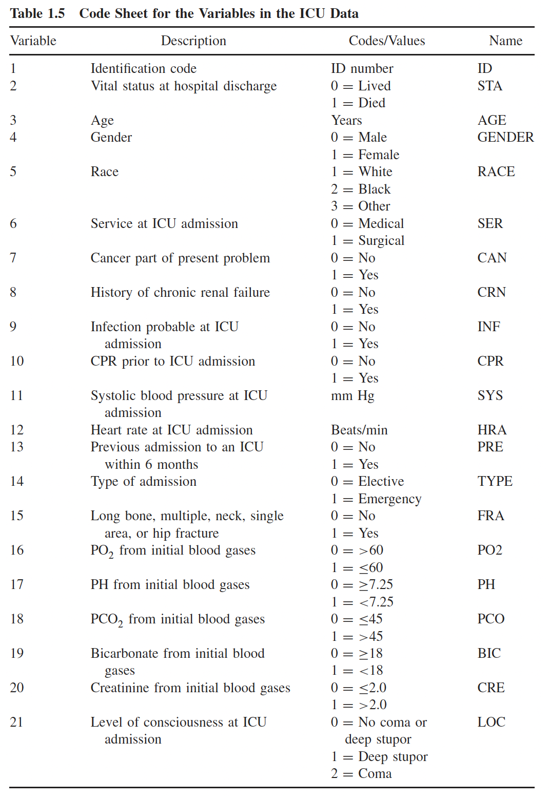

```{r setup, include=FALSE}
knitr::opts_chunk$set(echo = TRUE)

library(tidyverse)
library(rstatix)
library(broom)
library(gt)
library(janitor)
library(readxl)
library(haven)
library(here)
library(gtsummary) ## Added this package!!
library(kableExtra)
```

::: callout-caution
Ready to be worked on! (Nicky 4/21/26)
:::

## Purpose

This homework is designed to help you practice the following important skills and knowledge that we covered in Lessons 6-9:

-   Test a covariate for significance using the Wald test and LRT
-   Fit and interpret simple and multivariable logistic regression models
-   Interpret odds ratios and their confidence intervals
-   Evaluate model fit using likelihood-based methods
-   Apply data wrangling techniques to prepare variables for regression modeling
-   Communicate results of logistic regression analyses clearly and accurately in writing

## Directions

-   [Download the `.qmd` file here.](https://github.com/nwakim/BSTA_513_26S/blob/main/homework/HW_02.qmd)

-   You will need to download the datasets from our shared folder.

-   Please upload your homework to Sakai. Upload both your .qmd code file and the rendered .html file

    -   Please rename you homework as Lastname_Firstinitial_HW02.qmd. This will help organize the homeworks when the TAs grade them.

-   For each question, make sure to include all code and resulting output in the html file to support your answers

-   Show the work of your calculations using R code within a code chunk. Make sure that both your code and output are visible in the rendered html file. This is the default setting.

::: callout-tip
It is a good idea to try rendering your document from time to time as you go along! Note that rendering automatically saves your qmd file and rendering frequently helps you catch your errors more quickly.
:::

## Questions Part 1

The following questions are intended to give you **practice in understanding concepts** and **completing calculations**.

### Question 1 

This question is taken from the Hosmer and Lemeshow textbook. The ICU study data set consists of a sample of 200 subjects who were part of a much larger study on survival of patients following admission to an adult intensive care unit (ICU). The dataset should be available in our shared folder. The major goal of this study was to develop a logistic regression model to predict the probability of survival to hospital discharge of these patients. In this question, the primary outcome variable is vital (survival) status at hospital discharge, STA. Clinicians associated with the study felt that a key determinant of survival was the patient’s age at admission, AGE.

A code sheet for the variables to be considered is displayed in Table 1.5 below (from the Hosmer and Lemeshow textbook, pg. 23). We refer to this data set as the ICU data.

{width="700"}

#### Part a {#sec-L05-SLR}

Write down the equation for the population logistic regression model of STA on AGE. What characteristic of the outcome variable, STA, leads us to consider the logistic regression model as opposed to the usual linear regression model to describe the relationship between STA and AGE?

#### Part b {#sec-L05-SLR}

Write down an expression for the log-likelihood for the logistic regression model in Part a. This will be a mathematical expression. Please do not use generic expressions like $\pi(X)$, instead replace $X$ with the specific variables in this question.

#### Part c {#sec-L05-SLR}

Using the `glm()` function, obtain the maximum likelihood estimates of the coefficient parameters of the logistic regression model in Part a. Using these estimates, write down the equation for the fitted logistic regression model.

#### Part d {#sec-L08-Tests}

Use the Wald test to test whether or not the intercept ($\beta_0$) of the logistic regression model is significantly different from 0. Make sure to follow the steps laid out in class and include: hypothesis test, code/work leading to the computed test statistic, output including the test statistic and p-value, and conclusion.

#### Part e {#sec-L08-Tests}

Use the Likelihood Ratio test to test whether or not the coefficient for age ($\beta_1$) of the logistic regression model is significantly different from 0. Make sure to follow the steps laid out in class and include: hypothesis test, code/work leading to the computed test statistic, output including the test statistic and p-value, and conclusion.

#### Part f {#sec-L06-OR-interp}

Write a sentence interpreting the estimated odds ratio for age (the coefficient in Part e). Please include the 95% confidence interval.

#### Part g {#sec-L06-OR-interp}

Write a sentence interpreting the estimated odds ratio for a 10-year increase in age. Please include the 95% confidence interval. (Hint: We're scaling up the coefficient 10 times)


#### Part h {#sec-L07-pred-prob}

Compute the predicted probability of hospital discharge for a subject who is 63 years old. Compute the 95% confidence interval for the predicted probability and interpret the predicted probability.


### Question 2

We will continue to work with the ICU data in Question 1. Please refer back to the information above. In this question, we will use the ICU data to fit a multivariable logistic regression model.

#### Part a {#sec-L09-MLR}

From the above list (AGE, CAN, CPR, INF, and LOC) of independent variables, identify if each is a continuous, binary, or multi-level (\>2) categorical variable.

#### Part b {#sec-L09-MLR}

For the binary and multi-level categorical variables, please identify a reference group for each. Include justification for the reference group.

#### Part c {#sec-L09-MLR}

For the categorical variables (binary and multi-group), please mutate the variables within the ICU dataset to set your chosen reference groups.

#### Part d {#sec-L05-SLR-part-d}

Write down the equation for the logistic regression model of STA on CPR.

#### Part e  {#sec-L05-SLR}

Using the `glm()` function, obtain the maximum likelihood estimates of the coefficient parameters of the logistic regression model in Part d (@sec-L05-SLR-part-d). Using these estimates, write down fitted logistic regression model.

#### Part f {#sec-L06-OR-interp}

Write a sentence interpreting the odds ratio for the CPR in Part e's model. Please include the 95% confidence interval.

#### Part g {#sec-L05-SLR}

Write down the equation for the logistic regression model of STA on LOC.

#### Part h {#sec-L05-SLR}

Using the `glm()` function, obtain the maximum likelihood estimates of the coefficient parameters of the logistic regression model in Part h. Present the coefficient estimates. No need to write out the fitted regression equation.

Please take note of the warnings that you receive from fitting the `glm()` model and any large coefficient estimate with large confidence intervals. In this case, we have a category within LOC that has very few observations. (We will discuss this more in Lesson 14: Numerical Problems)

Check the number of observations that have a deep stupor and death at discharge and the number of observations that have a deep stupor and live at discharge. You can do this using the `table()` function to create a contingency table.

#### Part i {#sec-L06-OR-interp}

Write a sentence interpreting the odds ratio of death for the indicator of coma. Please include the 95% confidence interval.

## Questions Part 2

The following questions are intended to give you **practice in connecting concepts** that will help you make decisions in real world applications.

### Question 3 {#sec-L08-Tests}

Using a similar table to the one in Lesson 8, go back through the parts in this homework and determine which test can be run .

|   | Wald test | Score test | LRT |
|---------------------|-----------------|-----------------|-----------------|
| Question 1, Part d: testing intercept |  |  |  |
| Question 1, Part e: testing coefficient(s) for age |  |  |  |
| Question 2, Part e/f: testing coefficient(s)for CPR |  |  |  |
| Question 2, Part h/i: testing coefficient(s)for LOC |  |  |  |
