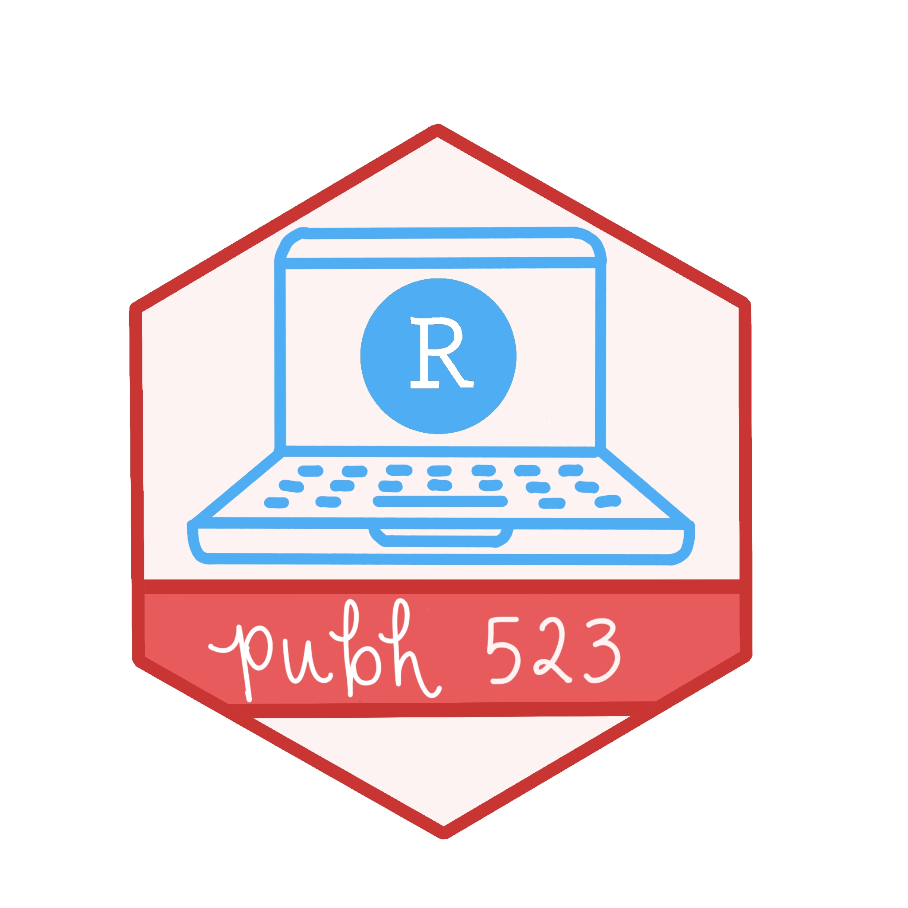

::: {style="background-color: #3070BF"}
::: {style="color: #FFFFFF"}

::: columns

::: {.column width="30%"}
{fig-align="center" width="337"}
:::

::: {.column width="65%"}

## PUBH 523: Introduction to R

### Summer 2026

 

This course provides an introduction to programming in R in public health, medicine, and related fields. Students will gain basic proficiency with the R environment and toolkit, focusing on reproducible workflows, data manipulation, visualization, and reporting. Topics include basic R programming, working in project-based folders, data transformations and summaries, data visualizations and plots, generating dynamic reports, and constructing summary tables.  By the end of the course, students will be comfortable initiating data exploration projects in R and will be prepared to apply these skills in further analysis courses. No prior statistical or coding experience is expected or required.

 
:::

::: {.column width="5%"}
:::

:::
:::
:::

::: {style="background-color: #F2EFEA"}
::: {style="color: #000"}

::: columns

::: {.column width="2%"}
:::

::: {.column width="23%"}
### Links

[]{style="color:#C83532;"} [OneDrive Folder](https://ohsuitg-my.sharepoint.com/:f:/r/personal/wakim_ohsu_edu/Documents/Teaching/Classes/BSTA_513_26S/Student_files_BSTA_513?csf=1&web=1&e=Q8KOMt)

[]{style="color:#C83532;"}[Echo 360](https://echo360.org/section/87bbad0a-58f2-4758-a290-b95378fbbab4/home)
:::

::: {.column width="25%"}
### Instructor

[]{style="color:#C83532;"} [Dr. Nicky Wakim](instructors.qmd)

[]{style="color:#C83532;"} Vanport 622A

[]{style="color:#C83532;"} [wakim\@ohsu.edu](mailto:wakim@ohsu.edu)

[]{style="color:#C83532;"} W 3-4pm
:::

::: {.column width="25%"}
### Office Hours
::: columns
::: {.column width="30%"}
[Nicky]()

[TA?](https://ohsu.webex.com/meet/akula)
:::
::: {.column width="70%"}
[]{style="color:#C83532;"} F 12-1pm

[]{style="color:#C83532;"} Th 3:30-4:30pm

:::
:::
:::

::: {.column width="25%"}
### Contacting me

E-mail or Slack is the best way to get in contact with me. I will try to respond to all course-related e-mails within 24 hours Monday-Friday.
:::
:::

:::
:::

------------------------------------------------------------------------

::: grid
::: g-col-9
:::

::: g-col-3
[ View the source on GitHub](https://github.com/nwakim/PUBH_523_26Su)
:::
:::
