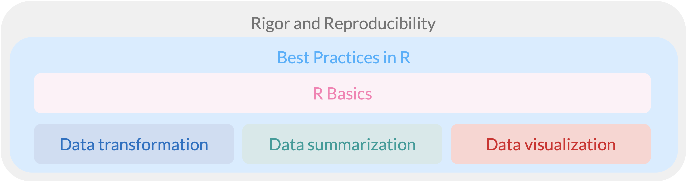

## Nicky Wakim (she/her)

::::::: columns
::: {.column width="45%"}
-   **Call me "Nicky," "Dr. W," "Professor Wakim," or any combo!**

-   Assistant Professor of Biostatistics

     

-   Grew up in DC area (Virginia side!)

-   Moved here from Michigan around 3 years ago

-   Two sweet kitties (and a third smush face from my roommate)

-   Volleyball, pickleball, ceramics, strolling around my neighborhood

-   But also sleeping, TV, and reading

-   Proud plant mamma (recently turned outdoor plant mamma)

-   *A few other things about myself that I will share non-publicly*
:::

::: {.column width="5%"}
:::

::: {.column width="25%"}
{width="450"} {width="450"} {width="450"}
:::

::: {.column width="25%"}
{width="450"}
:::
:::::::

## Our course description

Directly from the website:

> Welcome to PUBH 523/623! This course provides an **introduction to programming in R** in public health, medicine, and related fields. Students will gain basic proficiency with the R environment and toolkit, focusing on *reproducible workflows, data manipulation, visualization, and reporting*. Topics include basic R programming, working in project-based folders, data transformations and summaries, data visualizations and plots, generating dynamic reports, and constructing summary tables. By the end of the course, students will be **comfortable initiating data exploration projects in R** and will be **prepared to apply these skills in further analysis courses**. No prior statistical or coding experience is expected or required.

## Course Learning Objectives

At the end of this course, students should be able to...

 

1.  Set up and manage project-based folders to **build reproducible workflows**.

 

2.  **Clean, filter, restructure, and summarize datasets** using standard R toolkits.

 

3.  Create clear, publication-quality **data visualizations** and figures to represent trends and summaries.

 

4.  Launch a **data exploration project on a new dataset**, preparing it for advanced statistical analysis.

## Our course in the context of the data life cycle

::: columns
::: {.column width="30%"}
In this class, we will cover the following topics:

- Importing data
- Tidying data
- Transforming data
- Visualizing data
- Summarizing data
:::

::: {.column width="70%"}
](../img_slides/DS_process.png)
:::
:::

## Main themes in this course

 

{fig-align="center" width="60%"}