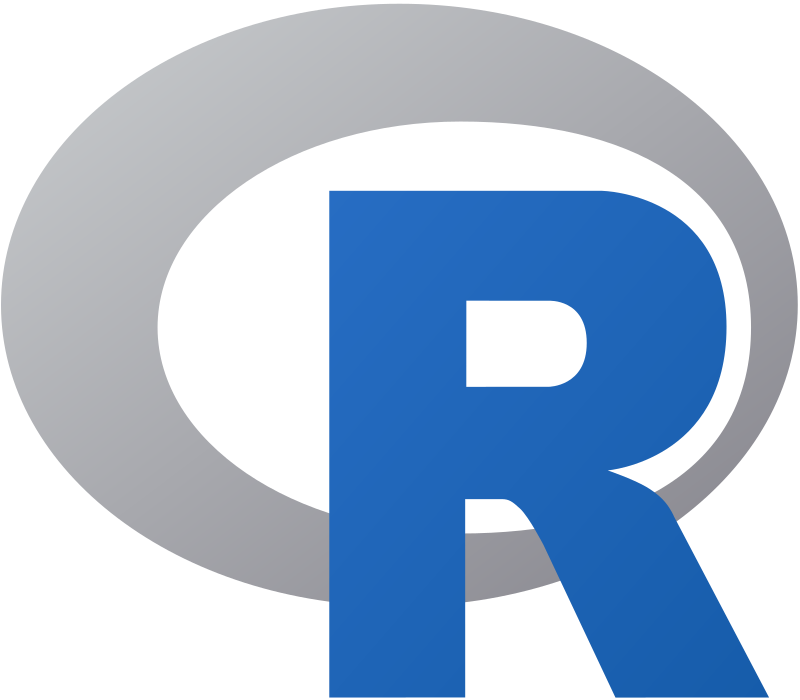

```{r}
#| label: "setup" 
#| include: false
#| message: false
#| warning: false

library(tidyverse)
library(lubridate)
library(janitor)
library(here)

# terminal: for icons
# quarto install extension quarto-ext/fontawesome
```

# Learning Objectives

1. Understand the difference between R and RStudio
2. Download and install R and RStudio

## Introduction to R

](../img_slides/horst_welcome_R.png){fig-align="center"}

## What is R?

::::: columns
::: {.column width="70%"}
- A programming language
- Focus on statistical modeling and data analysis
- Useful for epidemiology, biostatistics, and data science
- Great visualizations
- Also useful for most anything else you'd want to tell a computer to do
- Interfaces with other languages i.e. python, C++, bash
- Free and open source!
:::

::: {.column width="30%"}

:::
:::::

## What is RStudio?

::::: columns
::: {.column width="50%"}
- R is a programming language
:::

::: {.column width="50%"}
- RStudio is an integrated development environment (IDE)\
  - An interface to use R (with perks!)
:::
:::::

](../img_slides/r_vs_rstudio_1.png){fig-align="center"}

## We open RStudio on our computer (not R!)

- When you are on your computer, you will open RStudio to use R
- If you open R directly, it will much harder to navigate!

 

:::::::::::::: columns

::: {.column width="10%"}
:::

:::::: {.column width="35%"}
::::: blue
::: blue-ttl
Do NOT open this!
:::

::: blue-cont
{fig-align="center" width="500"}
:::
:::::
::::::

::: {.column width="10%"}
:::

:::::: {.column width="35%"}
::::: pink
::: pink-ttl
Open this!
:::

::: pink-cont
{fig-align="center" width="438"}
:::
:::::
::::::

::: {.column width="10%"}
:::
::::::::::::::

## RStudio anatomy

](../img_slides/RStudio_Anatomy.svg){fig-align="center"}

Read more about RStudio's layout in Section 3.4 of [Getting Used to R, RStudio, and R Markdown](https://ismayc.github.io/rbasics-book/3-rstudiobasics.html#rstudio-layout){target="_blank"} (Ismay and Kennedy 2021)

## So let's download them!

- Use this link to start: <https://posit.co/download/rstudio-desktop/>

 

- You must install R first
  - Even if you have R installed already, I highly recommend installing the latest version
  - In the future, you will periodically want to update this
- Install RStudio Desktop Open Source License (second)
