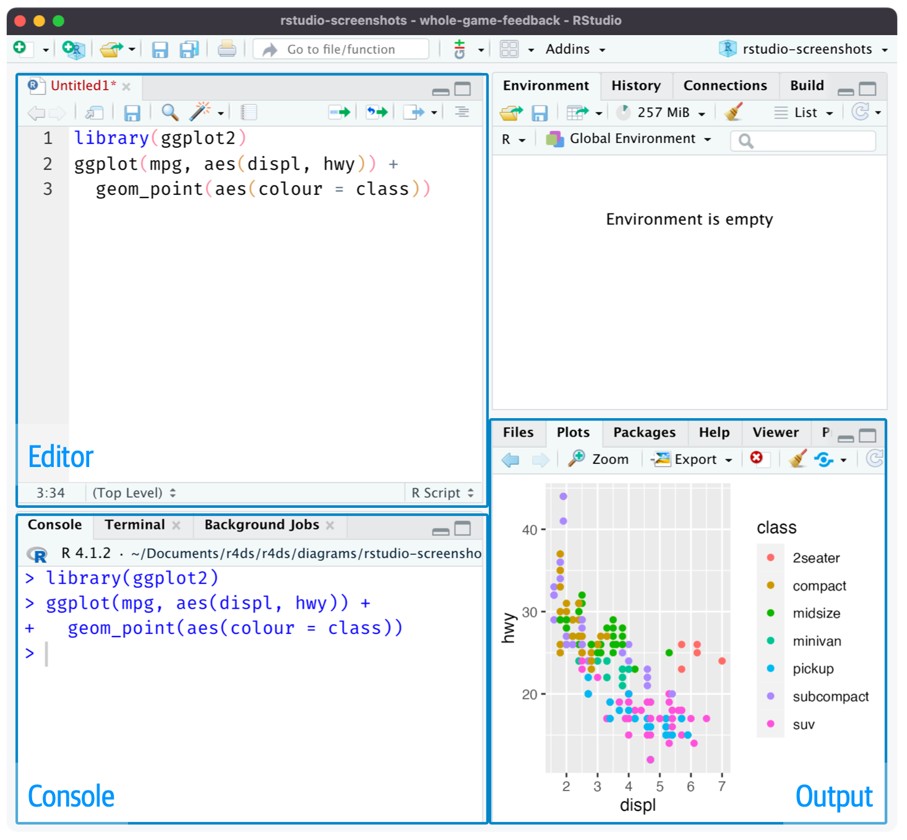

```{r}
#| label: "setup" 
#| include: false
#| message: false
#| warning: false

library(tidyverse)
library(lubridate)
library(janitor)
library(here)
```

# What is an R script?

::: columns
::: {.column width="45%"}
::: pink
::: pink-ttl
R script
:::
::: pink-cont
An **R script** is a document that can hold your code, comments, and outputs
:::
:::

- Unlike the console, we can **save our work in an R script** and **come back to it later**
- Think of this like a very basic Word or Google document file
:::
::: {.column width="55%"}

:::
:::

## How to create an R script?

::: columns
::: {.column width="48%"}
Create a new R script by going to `File` > `New File` > `R Script`



:::
:::{.column width="4%"}
:::
::: {.column width="48%"}
Create a new R script by clicking `New File` icon in the toolbar and selecting `R Script`


:::
:::


## How to run code in an R script?

::: columns
::: {.column width="25%"}
1. Highlighting the code and clicking the `Run` button in the toolbar
2. Highlighting the code and `Ctrl + Enter` (Windows) or `Cmd + Enter` (Mac)
3. Placing the cursor on the line of code and clicking the `Run` button in the toolbar
4. Placing the cursor on the line of code and `Ctrl + Enter` (Windows) or `Cmd + Enter` (Mac)
:::
::: {.column width="2%"}
:::
::: {.column width="73%"}

:::
:::

## Saving an R script

::: columns
::: {.column width="25%"}
1. Go to `File` > `Save` or `Save As`
2. Click the `Save` icon in the toolbar
3. Click the `Save` icon in the Editor
:::
::: {.column width="2%"}
:::
::: {.column width="73%"}

:::
:::


