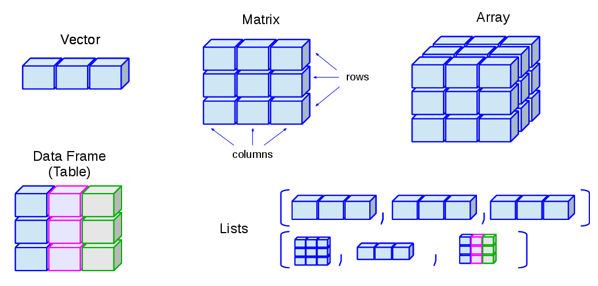

```{r}
#| label: "setup" 
#| include: false
#| message: false
#| warning: false

pacman::p_load(
  tidyverse, 
  lubridate,
  janitor,
  here
)
```

## What are R objects?

- R objects are stored "things" in R
- R objects can be data, numbers, text, model output, etc.
- R objects are created with **assignments** that can be used in later commands

## How can we create an object?

Here is the generic way we assign something like a `value` to an `object_name`:

 

```{r}
#| eval: false
object_name <- value
```

 

- Reads as "object name gets value" or "value is assigned to object name"

## A note on the assignment operator

- Can assign a variable using either `=` or `<-`
  - **Using `<-` is preferable** for certain occasions
  - I usually just use `=` because less typing hehe

```{r}
x = 5
x
x <- 5
x
```

## Objects can include text (characters)

```{r}
hi <- "hello"
hi

greetings <- c("Guten Tag", "Hola", hi)
greetings
```

## Types of objects



## Types of objects

| Class | What is it? | Examples |
|------------------------|------------------------|------------------------|
| Character | These are text or words that are in quotations. Math cannot be done on these. | `“My example character”` |
| Integer | Whole numbers | `-5`, `14`, or `2000` |
| Numeric | Numbers that can include decimals | `-5.3`, `14.5`, or `2000.0001` |
| Factor |  |  |
| Date | Character that represents a date | `"12-13-2005"` |
| Logical | Values that take TRUE or FALSE | `TRUE` or `FALSE` |
| Vector |  |  |
| Matrix |  |  |
| data.frame |  |  |
| list |  |  |

## 

You can **c**ombine multiple elements into a vector with `c()`:

```{r}
primes <- c(2, 3, 5, 7, 11, 13)
```

And basic arithmetic on vectors is applied to every element of the vector:

```{r}
primes * 2
primes - 1
```
