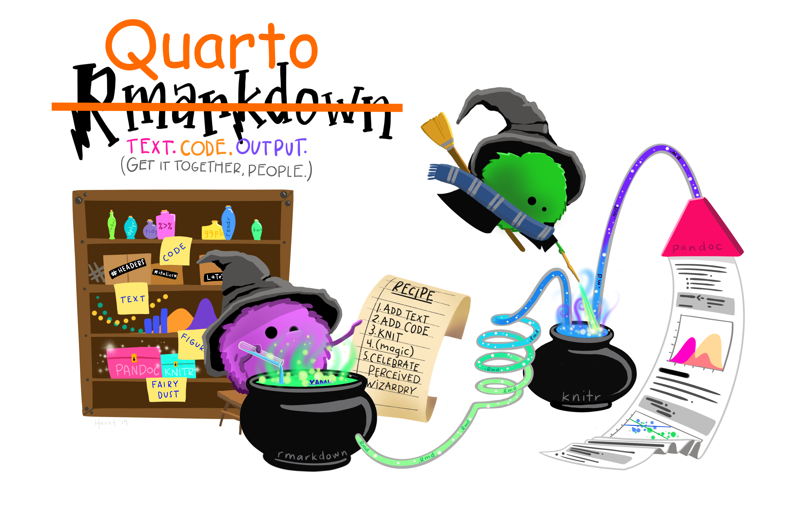
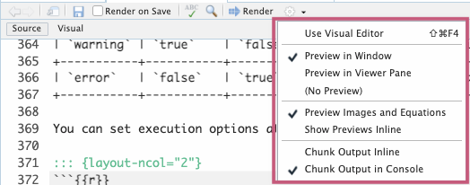

```{r}
#| label: "setup" 
#| include: false
#| message: false
#| warning: false

pacman::p_load(
  tidyverse, 
  lubridate, 
  janitor, 
  here, 
  readxl, 
  gt, 
  rstatix
)

theme_set(theme_grey(base_size = 24)) 
```


## What is Quarto?

- Quarto is a **publishing system** that lets us combine **text** and **code** into a single document
- It is the successor to R Markdown — you may see both names online, but we'll use Quarto



## `.qmd` file = code + text

A `.qmd` file holds two things together:

- [**Code** (R or other languages)]{style="color:#BF396F"} — the same code you'd write in a script
- [**Text** (like you'd write in Word)]{style="color:#367B79"} — headings, explanations, formatting

When you **render** the file, Quarto combines them into a polished output: `.html`, `.pdf`, `.docx`, and more.

](../img_slides/horst_quarto_schematic2.png){fig-align="center"}

## 3 types of content in a `.qmd`

Every `.qmd` file is made up of exactly three things:

1. **YAML metadata** — settings at the top of the file (title, author, output format)
2. **Text** — plain writing, lists, images, links
3. **Code chunks** — blocks of R (or other) code

We'll look at each one in detail — but first, let's see them all together in a real example.

{target="_blank"}](../img_slides/horst_hedgehog_text_code.png){fig-align="center"}

## A complete `.qmd` file

Here's what a full `.qmd` file looks like — we'll break down each piece next.

```` markdown
---
title: "Hello, Penguins"       
format: html                   
execute:
  echo: false
---

## Meet the penguins           

The `penguins` data contains size measurements for 
penguins from three islands in the Palmer Archipelago, 
Antarctica.

```{{r}}                        
#| label: fig-penguins
#| warning: false

pacman::p_load(tidyverse, palmerpenguins)

penguins |>
  ggplot(aes(x = flipper_length_mm, y = bill_length_mm)) +
  geom_point(aes(color = species)) +
  theme_minimal()
```
````

## 1. YAML metadata

::: columns
::: {.column width="49%"}

- The YAML block sits at the **very top** of the file, between `---` lines
- It controls settings like title, author, and output format

  ``` markdown
  ---
  title: "Hello, Penguins"
  format: html
  execute:
    echo: false
  ---
  ```

- [More YAML options](https://quarto.org/docs/reference/formats/opml.html) on Quarto website

:::

::: {.column width="2%"}
::: 
::: {.column width="49%"}
::: blue
::: blue-ttl
What you'll see in your practice assignments
:::
::: blue-cont
  ``` markdown
  ---
  title: "Practice 2"
  subtitle: "PUBH 523/623"
  author: "Your name here"
  date-modified: "today"
  format: 
    html:
      link-external-newwindow: true
      toc: true
      self-contained: true
      page-layout: full
      html-math-method: mathjax
  editor_options: 
    chunk_output_type: console
  ---
  ```
:::
:::
:::
:::

## 2. Text

Outside of code chunks, you write plain text using **Markdown** formatting:

```markdown
## This is a heading

### This is a subheading

This is a regular paragraph. You can make text **bold** or *italic*.

- This is a bullet point
- Another bullet point
```

- More R Markdown capabilities
  - [rmarkdown Cheatsheet](https://rstudio.github.io/cheatsheets/html/rmarkdown.html)
  - **In RStudio:** Help → Markdown Quick Reference

::: green
::: green-cont
**Tip:** Use the **Visual Editor** (top of the editor window) for a Word-like experience if you prefer not to write raw Markdown yet.
:::
:::

## 3. Code chunks

Code chunks are where your R code lives

```` markdown
```{{r}}
#| label: fig-penguins
#| warning: false

penguins |>
  ggplot(aes(x = flipper_length_mm, y = bill_length_mm)) +
  geom_point(aes(color = species))
```
````


- There are 3 options to insert a new code chunk:

1. Click the  button at the top of the editor
2. Keyboard shortcut: *Command + Option + I* (Mac) / *Ctrl + Alt + I* (PC)
3. Type out ` ```{r} ` to start and ` ``` ` to close


## Code chunk options

You can control how a chunk behaves with `#|` options at the top of the chunk:

| Option | What it does |
|--------|--------------|
| `echo: false` | Hides the code in output (results still show) |
| `warning: false` | Hides warnings from the output |
| `include: false` | Hides both code and results (still runs) |
| `eval: false` | Don't run the code (no output) |

```{{r}}
#| echo: false #<1>
#| warning: false 
#| eval: false #<2>
```

1. This is helpful if you do not want to show your code
2. This is helpful if your `qmd` file has code that doesn't work or takes a long time to run, but you still want to render the document

## Making a `.qmd` file: overview

Four steps:

1. **Create** a new Quarto file
2. **Edit** the file
3. **Save** the file
4. **Render** to create the `.html` output

## Step 1: Create a Quarto file

::::: columns
::: {.column width="50%"}
**Two options:**

1. `File` → `New File` → `Quarto Document...` → `OK`
2. Click {width="92"} in the upper left → {width="333"}

**In the pop-up window:**

- Enter a **title** and your **name**
- Output format: `HTML`
- Engine: `Knitr`
- Editor: `Use visual markdown editor`
- Click `Create`
:::

::: {.column width="50%"}

:::
:::::

## Step 2: Edit the file

::::: columns
::: {.column width="50%"}
- After clicking `Create`, a template `.qmd` opens in your editor
- Try editing the title in the YAML, or changing the text below it
- Make sure you only edit content **at and below** the `---` that ends the YAML
:::

::: {.column width="50%"}
{fig-align="center"}
:::
:::::

## Step 3: Save the file

- `File` → `Save`
- Click {width="51" height="43"} above the editor window
- Keyboard shortcut: *Ctrl + S* (PC) / *Command + S* (Mac)

**When saving, specify:**

- **Filename** — always use `.qmd` as the extension
- **Folder** — save under your lessons folder as `lesson#_quarto_work.qmd`


## Step 4: Render to HTML

**Rendering** turns your `.qmd` into a viewable `.html` file.

Two options:

1. Click the **Render** icon  at the top of the editor
2. Keyboard shortcut: *Command + Shift + K* (Mac) / *Ctrl + Shift + K* (PC)

After rendering:

- A new window opens with the HTML output
- Both `.qmd` and `.html` files appear in your folder — the HTML takes its name from the `.qmd`

## `.qmd` vs. `.html` output

- In this class, you'll turn in **both** files
- Collaborators typically only need the `.html` — they can view results without running any code themselves

:::::: columns
::: {.column width="48%"}
### `.qmd` file

{fig-align="center" width="600"}
:::

::: {.column width="4%"}
:::

::: {.column width="48%"}
### `.html` output

{fig-align="center" width="650"}
:::
::::::

## Tips: Customizing your setup

::: columns
::: column
**Where does the HTML preview open?**

- `Preview in Window` — opens in a browser tab
- `Preview in Viewer Pane` — opens in the bottom-right RStudio pane

:::
::: column
**Where does code output appear?**

- `Chunk Output Inline` — output appears below the chunk in the editor
- `Chunk Output in Console` — output appears in the Console pane
:::
:::

 

{fig-align="center" width="60%"}

 

## Wrap-up

- We learned about Quarto and `.qmd` files, which combine text and code into a single document

 

- We explored the three main components of a `.qmd` file: 
  - YAML metadata
  - Text
  - Code chunks

 

- We practiced creating, editing, saving, and rendering a `.qmd` file to produce an HTML output

## Resources

- [More YAML options](https://quarto.org/docs/reference/formats/opml.html) on Quarto website
- [rmarkdown Cheatsheet](https://rstudio.github.io/cheatsheets/html/rmarkdown.html)
- Publish and Share with Quarto
  - [PDF Cheatsheet](https://rstudio.github.io/cheatsheets/quarto.pdf)
  - [html Cheatsheet](https://rstudio.github.io/cheatsheets/html/quarto.html)
- [Quarto: The Practical Guide](https://quarto-tdg.org/) by by Mine Çetinkaya-Rundel and Charlotte Wickham
- To learn more about working with Quarto, check out our BERD workshop: [*Creating Professional Presentations and Websites using R/Quarto*](https://ohsu-octri-berd.github.io/Quarto_BERD_2025/)