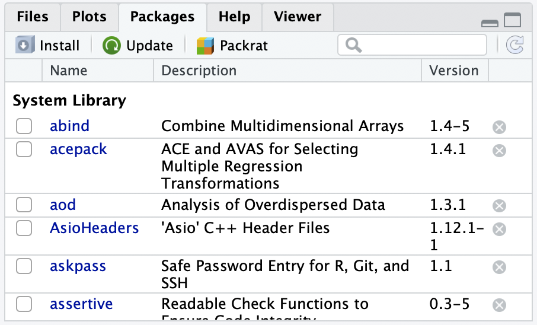

```{r}
#| label: "setup" 
#| include: false
#| message: false
#| warning: false

pacman::p_load(
  tidyverse, 
  lubridate,
  janitor,
  here
)
```

## What are R packages?

A good analogy for R packages is that **they are like apps you can download onto a mobile phone**:

](../img_slides/R_vs_R_packages.png){fig-align="center"}

- Packages contain **additional functions and data** that are not built into R

## Installing packages

Thee options to install packages:

::::: columns
::: {.column width="50%"}
1.  Use `install.packages()` with the package name in quotes

    ```{r}
    #| eval: false

    install.packages("janitor")   
    ```

 

2.  **Preferred way:** Use `pacman::p_load()` with the package name

    ```{r}
    #| eval: false

    pacman::p_load(janitor)   
    ```
:::

::: {.column width="50%"}
3.  The "Packages" tab in [Viewer pane]{style="color:#459B99;"}

{fig-align="center"}
:::
:::::

## From installing to loading

- **Only install packages once** *(unless you want to update them)*
- Installed from [Comprehensive R Archive Network (CRAN)](https://cran.r-project.org/) = package mothership

 

- Once packages are installed, **we need to load them every time we want to use them in R**
- **Tip:** at the top of your files, have a segment of code dedicated to loading packages
  - This way, you can easily see and load packages required for your code


## Loading packages

Two options to load packages:

::::: columns
::: {.column width="50%"}
1.  Use `library()` with the package name (no quotes!)

    ```{r}
    #| eval: false

    library(janitor)   
    ```

:::

::: {.column width="50%"}
2.  **Preferred way:** Use `pacman::p_load()` with the package name

    ```{r}
    #| eval: false

    pacman::p_load(janitor)   
    ```

::: blue
::: blue-cont
**Note:** this is the same as installing with `p_load()`

- That's because `p_load()` will install the package if it is not already installed, and then load it
:::
:::

:::
:::::

## Packages used in this class

:::::: columns
::: {.column width="33%"}

::: pink
::: pink-ttl
For **loading**/**saving** data
:::
::: pink-cont
- `here`
- `readr`
- `readxl`
- `haven`
- `writexl`
:::
:::
:::
::: {.column width="33%"}

::: blue
::: blue-ttl
For **summarizing**/**visualizing** data
:::
::: blue-cont
  - `janitor`
  - `gt`
  - `rstatix`
  - `gtsummary`
  - `naniar`
  - `ggplot2`
:::
:::
:::

::: {.column width="33%"}
::: green
::: green-ttl
For **wrangling** data
:::
::: green-cont
  - `dplyr`
  - `tidyr`
  - `tibble`
  - `forcats`
  - `lubridate`
  - `stringr`
:::
:::
:::
::::::

## Tidyverse

](../img_slides/tidyverse_packages.png)

## Install and load packages

- Note that I am using `pacman::p_load()`

  - `::` is used to access a package's function without loading the whole package
  - I am accessing `p_load()` from the `pacman` package

```{r}
pacman::p_load(
  tidyverse, #<1>
  here, #<2>
  readxl, 
  haven, 
  writexl, #<2>
  janitor, #<3>
  rstatix, 
  gt,
  gtsummary, 
  naniar #<3>
)
```

1. `tidyverse` contains most of our needed packages
2. These are the extra packages we need for loading/saving data
3. These are the extra packages we need for summarizing/visualizing data

## References

- Danielle Navarro’s YouTube video on ***Installing and loading R packages***: <https://www.youtube.com/watch?v=kpHZVyDvEhQ>
  - If you want to get more information on packages
- [Comprehensive R Archive Network (CRAN)](https://cran.r-project.org/) = package mothership
- There is an additional textbook: [Hands-On Programming with R by Garrett Grolemund](https://www.rstudio.com/resources/books/hands-on-programming-with-r/)
  - [Here is the chapter on packages](https://rstudio-education.github.io/hopr/packages.html#getting-help-with-help-pages)
