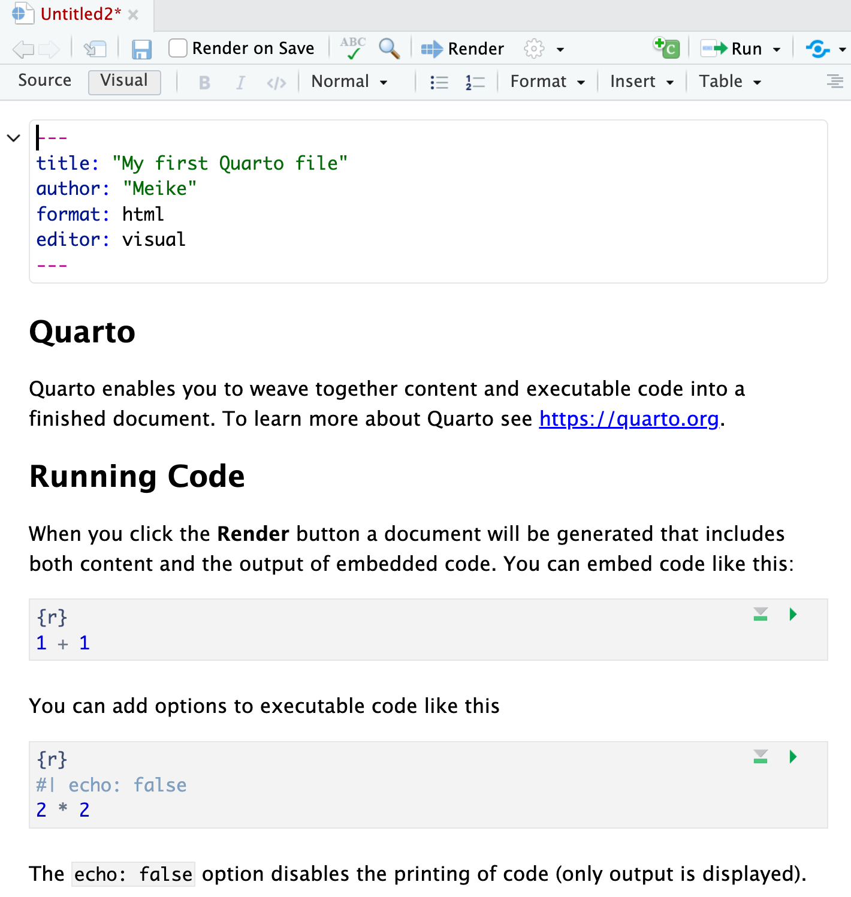
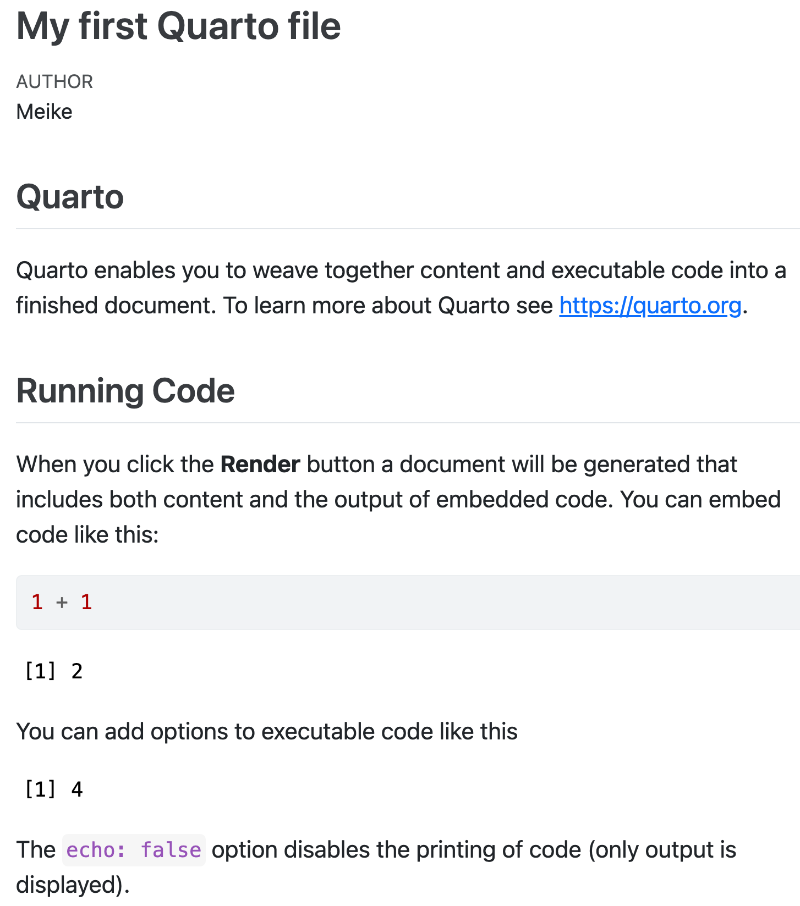
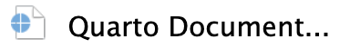
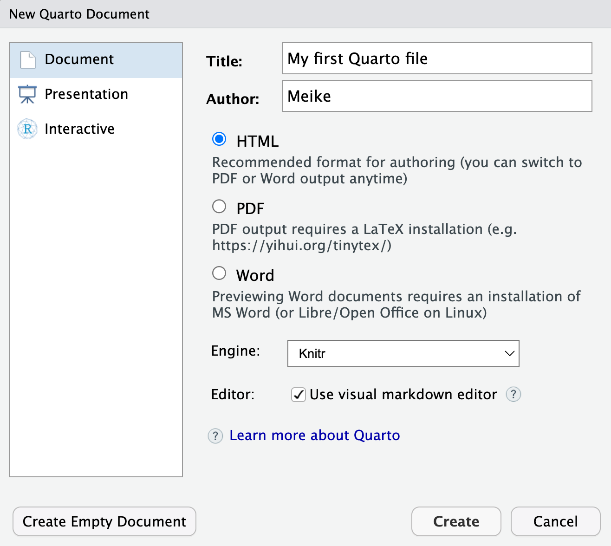
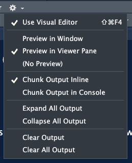
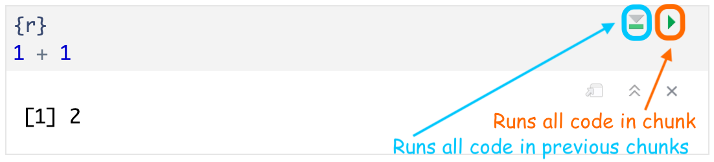
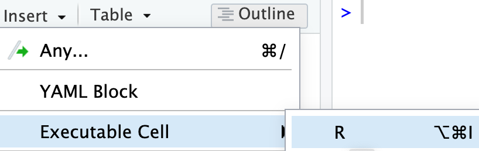

```{r}
#| label: "setup" 
#| include: false
#| message: false
#| warning: false

pacman::p_load(
  tidyverse, 
  lubridate, 
  janitor, 
  here, 
  readxl, 
  gt, 
  rstatix
)

theme_set(theme_grey(base_size = 24)) 
```

```{r}
#| echo: false
# library(readxl)
# note we are saving the data from the Excel file in our environment 
# with the object name hrs_data
hrs_data2 <- read_excel(here("./data/hrs_data_narch.xlsx"))
hrs_data <- read_excel(here("./data/hrs_data.xlsx"))
hrs_data <- clean_names(hrs_data) %>%
  relocate(race_original, female, .after = degree)#
```

# Saving your work with Quarto

](../img_slides/horst_rmarkdown_wizards_quarto.png){fig-align="center"}

## Quarto = `.qmd` file = Code + text

[We can take `.qmd` files containing code (R and other types) + plain text (like we might make in Word)]{style="color:#BF396F"}, and then render to it [other formats (html, pdf, Word, etc) that nicely display the code and text!]{style="color:#367B79"}

](../img_slides/horst_quarto_schematic2.png){fig-align="center"}

## We often render a `.qmd` file to an `.html` file

:::::: columns
::: {.column width="48%"}
### `.qmd` file

{fig-align="center" width="696"}
:::

::: {.column width="4%"}
:::

::: {.column width="48%"}
### `.html` output

{fig-align="center" width="718"}
:::
::::::

# Basic Quarto example

](../img_slides/horst_quarto_moon_penguins.png){fig-align="center"}

## Before we get further in `.qmd` files

- Let's make sure we all have Rstudio open
- And then open your `PUBH_523_26Su` project!

 

### Steps for making a Quarto file

1.  Create a Quarto file (`.qmd`)
2.  Edit a Quarto file (`.qmd`)
3.  Save the Quarto file (`.qmd`)
4.  Create html file

## 1. Create a Quarto file (`.qmd`)

::::: columns
::: {.column width="50%"}
**Two options:**

1.  click on File $\rightarrow$ New File $\rightarrow$ Quarto Document...$\rightarrow$ OK,
2.  or in upper left corner of RStudio click on {width="92"} $\rightarrow$ {width="333"}

**Pop-up window selections:**

- Enter a title and your name
- Select `HTML` output format (default)
- Engine: select `Knitr`
- Editor: Select `Use visual markdown editor`
- Click `Create`
:::

::: {.column width="50%"}

:::
:::::

## 2. Edit a Quarto file (`.qmd`)

::::: columns
::: {.column width="50%"}
- After clicking on `Create`, you should then see the following in your editor window:

 

- You can try editing the text or changing the code!
  - Make sure you are only editing at the "Quarto" header and below
:::

::: {.column width="50%"}
{fig-align="center"}
:::
:::::

## 3. Save the Quarto file (`.qmd`)

- **Save the file** by
  - selecting `File -> Save`,
  - or clicking on {width="51" height="43"} (towards the left above the scripting window),
  - or keyboard shortcut
    - PC: *Ctrl + s*
    - Mac: *Command + s*
- You will need to specify (Use what we learned in last lesson!!)
  - a **filename** to save the file as
    - ALWAYS use **.qmd** as the filename extension for Quarto files
  - the **folder** to save the file in
  - Hint: this will probability go under "R_activities" and with a name like "R05_Quarto-work.qmd"

## 4. Create `html` file

We create the `.html` file by **rendering** the `.qmd` file.

Two options:

1.  click on the Render icon  at the top of the editor window,
2.  or use keyboard shortcuts
    - Mac: *Command+Shift+K*
    - PC: *Ctrl+Shift+K*

- A new window will open with the html output.
- You will now see both .qmd and .html files in the folder where you saved the .qmd file.
  - The `html` file will automatically have the same name as the `qmd` file

## Tip: changing the render view

- You can change where your `.html` file pops up
- I have it set to open in the "Viewer Pane" in the bottom right

 

{fig-align="center" width="30%"}

## `.qmd` vs. its `.html` output

:::::: columns
::: {.column width="48%"}
### `.qmd` file

{fig-align="center" width="696"}
:::

::: {.column width="4%"}
:::

::: {.column width="48%"}
### `.html` output

{fig-align="center" width="718"}
:::
::::::

## 3 types of Quarto content

1.  YAML metadata
2.  Text, lists, images, tables, links
3.  Code chunks

{target="_blank"}](../img_slides/horst_hedgehog_text_code.png){fig-align="center"}

## Source File: hello.qmd

```` markdown
---
title: "Hello, Penguins"
format: html
execute:
  echo: false
---

## Meet the penguins

The `penguins` data contains size measurements for 
penguins from three islands in the Palmer Archipelago, 
Antarctica.

The three species of penguins have quite distinct 
distributions of physical dimensions (@fig-penguins).

```{{r}}
#| label: fig-penguins
#| fig-cap: "Dimensions of penguins across three species."
#| warning: false
library(tidyverse, quietly = TRUE)
library(palmerpenguins)
penguins |>
  ggplot(aes(x = flipper_length_mm, y = bill_length_mm)) +
  geom_point(aes(color = species)) +
  scale_color_manual(
    values = c("darkorange", "purple", "cyan4")) +
  theme_minimal()
```
````

## 1. YAML metadata

-   Set format(s) and options.
    Use YAML Syntax.

    ``` markdown
    ---
    title: "Hello, Penguins"
    format: html
    execute:
      echo: false
    ---
    ```

## 2. Text, lists, images, tables, links

`## Write with **Markdown**`

**RStudio**: Help \> Markdown Quick Reference

RStudio, Positron and VS Code: Use the **Visual Editor**

``` markdown
## Meet the penguins

The `penguins` data contains size measurements for 
penguins from three islands in the Palmer Archipelago, 
Antarctica.

The three species of penguins have quite distinct 
distributions of physical dimensions (@fig-penguins).
```

## 3.  Code chunks
R, Python, Julia, Observable, or any language with a Jupyter kernel.

```` markdown
```{{r}}
#| label: fig-penguins
#| fig-cap: "Dimensions of penguins across three species."
#| warning: false
library(tidyverse, quietly = TRUE)
library(palmerpenguins)
penguins |>
  ggplot(aes(x = flipper_length_mm, y = bill_length_mm)) +
  geom_point(aes(color = species)) +
  scale_color_manual(
    values = c("darkorange", "purple", "cyan4")) +
  theme_minimal()
```
````

## Code Cells

Code cells start with ```` ```{language} ````, and end with ```` ``` ````.

RStudio, Positron & VS Code: Use **Insert Code Chunk/Cell**.

::: {layout-ncol="2"}
```{{r}}
#| label: chunk-id
```

```{{python}}
#| label: chunk-id
```
:::

Other languages: `{julia}`, `{ojs}`

Add code cell options with `#|` comments.

Cell options control [**execution**](#execution), [figures](#figures), [tables](#tables), layout and more.
See them all at: <https://quarto.org/docs/reference/cells/>

## Execution Options {#execution}

+-----------+-----------+----------------------------------------------------------+
| Option    | Default   | Effects                                                  |
+===========+===========+==========================================================+
| `echo`    | `true`    | `false`: hide code in output\                            |
|           |           | `fenced`: include code cell syntax                       |
+-----------+-----------+----------------------------------------------------------+
| `eval`    | `true`    | `false`: don't run code                                  |
+-----------+-----------+----------------------------------------------------------+
| `include` | `true`    | `false`: don't include code or results                   |
+-----------+-----------+----------------------------------------------------------+
| `output`  | `true`    | `false`: don't include results\                          |
|           |           | `asis`: treat results as raw markdown                    |
+-----------+-----------+----------------------------------------------------------+
| `warning` | `true`    | `false`: don't include warnings in output                |
+-----------+-----------+----------------------------------------------------------+
| `error`   | `false`   | `true`: include error in output and continue with render |
+-----------+-----------+----------------------------------------------------------+

You can set execution options at the **cell level**:

::: {layout-ncol="2"}
```{{r}}
#| echo: false
```

```{{python}}
#| echo: false
```
:::

## Enter and run code (2/2)

- We can run code like we saw in the lesson on Basics

- **Run all code** in a chunk by
  - by clicking the play button in the top right corner of the chunk
- The code output appears below the code chunk

{fig-align="center"}

::: callout-note
- The output should also appear in the Console.
- Settings can be changed so that the output appears only in the Console and not below the code chunk:
  - Select  (to right of Render button) and then *Chunk Output in Console*.
:::

## Create a code chunk

3 options to create a code chunk

1.  Click on  at top right of the editor window, or

2.  [**Keyboard shortcut**]{style="color:darkorange"}

|     |                        |
|-----|------------------------|
| Mac | *Command + Option + I* |
| PC  | *Ctrl + Alt + I*       |

3.  `Visual editor`: Select `Insert` -\> `Executable Cell` -\> `R`



## Resources

- To learn more about working with Quarto, check out our BERD workshop: [*Creating Professional Presentations and Websites using R/Quarto*](https://ohsu-octri-berd.github.io/Quarto_BERD_2025/)
- Publish and Share with Quarto 
  - [PDF Cheatsheet](https://rstudio.github.io/cheatsheets/quarto.pdf)
  - [html Cheatsheet](https://rstudio.github.io/cheatsheets/html/quarto.html)