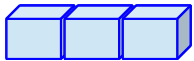
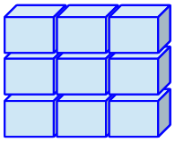
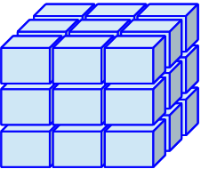
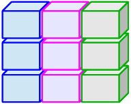
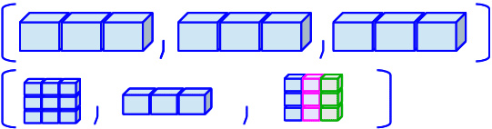

```{r}
#| label: "setup" 
#| include: false
#| message: false
#| warning: false

pacman::p_load(
  tidyverse, 
  lubridate,
  janitor,
  here, 
  readxl
)

hrs_data <- read_rds(here("data", "hrs_data.rds"))
hrs_data <- clean_names(hrs_data)
```

## What are R objects?

- R objects are stored "things" in R

 

- R objects can be data, numbers, text, model output, etc.
  - It can be a...
    - [**single piece of data**]{style="color: #5BAFF8;"}
      - like the number `5`
    - [**collection of data**]{style="color: #EF85B3;"}
      - like a dataset with 100 rows and 10 columns

 

- R objects are created with **assignments** that can be used in later commands

## How can we create an object?

Here is the generic way we assign something like a `value` to an `object_name`:

 

```{r}
#| eval: false
object_name <- value
```

 

- Reads as "object name gets value" or "value is assigned to object name"

## A note on the assignment operator

- Can assign a variable using either `=` or `<-`
  - **Using `<-` is preferable** for certain occasions
  - I usually just use `=` because less typing hehe

 

```{r}
x = 5
x
x <- 5
x
```

## Types of objects: [**single piece of data**]{style="color: #5BAFF8;"}

| Class |   | What is it? | Examples |
|------------|--------|----------------------------|---------------------|
| Doubles | `dbl` | Numbers | `-5.3`, `14.5`, or `2000.0001` |
| Integers | `int` | Whole numbers (no decimals), more specific than doubles | `-5`, `14`, or `2000` |
| Characters | `chr` | These are text or words that are in quotations. Math cannot be done on these. | `“My example character”` |
| Factor | `fct` | Categorical variables stored with levels/groups (good pkg: `forcats`) | `"blue"`, `"red"`, `"purple"` |
| Logical | `lgl` | Values that take TRUE or FALSE | `TRUE` or `FALSE` |
| Date | `date` | Character that represents a date (good pkg: `lubridate`) | `"12-13-2005"` |

## Types of objects: [**collection of data**]{style="color: #EF85B3;"}

| Class |   | Dimension | What does it contain? |
|:--------------|:------------|:--------------|:--------------------------|
| Vector |  | 1D | *all the same type\** of pieces of data |
| Matrix |  | 2D | *all the same type*\* of pieces of data |
| Array |  | ND | *all the same type\** of pieces of data |
| Data frame / table |  | 2D | *different types* of pieces of data |
| List |  | 1D | *other types of collections of data* |

\*If you put different types of data in a vector, matrix, or array, they will be coerced into characters

## Most datasets are data frames

```{r}
class(hrs_data) #<1>
```

1.  The `class()` function tells us the class of the object (in this case, `hrs_data` is a data frame)

```{r}
tibble(hrs_data) #<2>
```

2.  I want to take a look at the data, so I use the `tibble()` function to print it as a tibble

## Data frames and tibbles

- Did you notice the output of the tibble?

 

- Tibbles are a newer object type

 

- They are a modern take on data frames that are part of the tidyverse

 

- Main difference is that tibbles **print a little nicer within the console**
  - So we'll often see them as output for functions that display data frames

## Did you see the variables in the data frame?

- The columns in a data frame are called "variables"
- We can see the variable types in the tibble display

```{r}
tibble(hrs_data)
```

## Accessing variables in a data frame

- We can access variables in a data frame using the `$` operator

 

- I want to look at the first five entries of birth year

```{r}
head(hrs_data$birthyr)
```

- I want to look at the first five entries of degree

```{r}
head(hrs_data$degree)
```

- Notice, degree will also show the levels of the factor variable

## Checking the object type of a variable

- We can also check the object type of each variable without viewing the whole data frame

 

- Birth year is a numeric variable, so it is a double (`dbl`)

```{r}
class(hrs_data$birthyr)
```

- While degree is a factor variable, so it is a factor (`fct`)

```{r}
class(hrs_data$degree)
```

## Wrap-up

- We learned about...
  - R objects
  - Assigning values to objects
  - Different types of objects 
    - [**single piece of data**]{style="color: #5BAFF8;"}
    - [**collection of data**]{style="color: #EF85B3;"}
  - Data frames and tibbles

## Resources

- There is an additional textbook: [Hands-On Programming with R by Garrett Grolemund](https://www.rstudio.com/resources/books/hands-on-programming-with-r/)
  - [Here is the chapter on objects](https://rstudio-education.github.io/hopr/r-objects.html)
- [Page on tibble package](https://tibble.tidyverse.org/)
