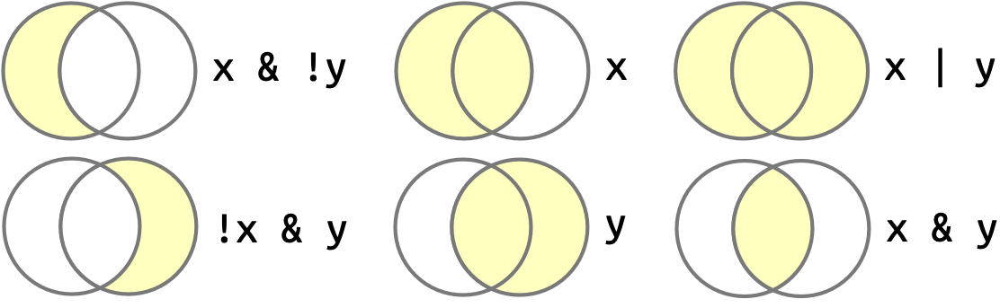

```{r}
#| label: "setup" 
#| include: false
#| message: false
#| warning: false

pacman::p_load(
  here, 
  tidyverse, 
  writexl, 
  rstatix, 
  janitor, 
  naniar,
  gt,
  gtsummary,
  readxl, 
  rio
)
```

```{r}
#| label: "import data" 
#| echo: false
hrs_data_rds <- import(here("data", "hrs_data.rds"))
hrs_00 <- clean_names(hrs_data_rds) |>
  relocate(diab, degree, .after = id)
hrs_degree_chr = hrs_00 |>
  mutate(degree = as.character(degree))
  # select(id, age_yr, ed, cesd, degree, srh)
```

## More advanced data transformations

- We've learned some important functions for transforming data for row-wise and column-wise operations:
  - `filter()` to filter rows
  - `select()` to select columns
  - `mutate()` to create new variables

 

- This lesson will cover some more advanced techniques for transforming rows and columns:
  - Combining conditions with `&`, `|`, and `%in%`
  - Checking your work with `arrange()` and `count()`
  - Working with factors
  - Create new variables based on conditions
  - Select columns by name pattern or data type

# Combining conditions with `&`, `|`, and `%in%`

## Applying relational operators to filter rows

- Recall the infographic from the previous lesson (Key operators and functions): 

- We can use these logical operators to filter rows based on multiple criteria

## A quick example

- If we wanted to return participants who identified as **diabetic but DO NOT have a Master's degree**
  - We would use an `&` to chain these criteria together:

```{r}
hrs_01_filter_diab_nMS = hrs_00 |>
  filter(diab == "Yes" & degree != "Master's degree") # <1>
tibble(hrs_01_filter_diab_nMS)
```

1.  Think about which Venn Diagram this would represent (`x & !y`)

## Filtering with `&` (AND) criteria (1/2)

:::: pink2
::: pink2-cont
This relational operator `&` is used to filter rows that meet **both** criteria
:::
::::

If we want to filter for participants who identify as **diabetic AND have a Master's degree**, we would use:

```{r}
hrs_02_filter_diab_MS = hrs_00 |>
  filter(diab == "Yes" & degree == "Master's degree")
tibble(hrs_02_filter_diab_MS)
```

## Filtering with `&` (AND) criteria (2/2)

- Note that we could also use the comma in this case:

```{r}
hrs_02_filter_diab_MS = hrs_00 |>
  filter(diab == "Yes",    # <1>
         degree == "Master's degree")
tibble(hrs_02_filter_diab_MS)
```

1.  Comma is equivalent to "&" within `filter()`

## Filtering with `|` (OR) criteria

:::: green
::: green-cont
This relational operator `|` is used to filter rows that meet **either** criteria
:::
::::

If we want to filter for participants who identify as **diabetic OR have a Master's degree**, we would use:

```{r}
hrs_03_filter_diab_or_MS = hrs_00 |>
  filter(diab == "Yes" | degree == "Master's degree")
tibble(hrs_03_filter_diab_or_MS)
```

## Filtering with `%in%` (1/2)

- If we want to filter for multiple specific values in one column, we can use `%in%` instead of chaining several `|` conditions

- Example: if we wanted participants whose `degree` was "GED", "High school diploma", or "None", we could use:

```{r}
hrs_04_filter_degree = hrs_00 |>
  filter(degree %in% c("GED", "High school diploma", "None")) # <1>
tibble(hrs_04_filter_degree)
```

1.  `%in%` checks whether the value in `degree` matches *any* value in the vector we provide.

## Filtering with `%in%` (2/2)

- The following code blocks are equivalent, but the first one is more concise and easier to read

- With `%in%`:

```{r}
#| output: false
hrs_00 |>
  filter(degree %in% c("GED", "High school diploma", "None"))
```

- With `|` (OR):

```{r}
#| output: false
hrs_00 |>
  filter(degree == "GED" | degree == "High school diploma" | degree == "None")
```

:::: orange
::: orange-cont
`%in%` is especially useful when you have many values to check within a single column
:::
::::

# Checking your work with `arrange()` and `count()`

## A good check that you are filtering correctly

:::: blue
::: blue-cont
Think about the number result you expect: Which of the AND vs. OR code blocks will return a larger number of participants?
:::
::::

You can check your work by using `count()` to see how many participants meet each criteria:

```{r}
hrs_00 |>
  count(diab, degree)
```

## `arrange()` after `count()`-ing categorical data

- Sometimes it helps to arrange by that category if you have many categories to view
- This can also alert us if there are categorical coding mistakes (such as misspellings) in our data

```{r}
hrs_00 |>
  count(degree) |>
  arrange(n)
```

# Working with categorical data and factors

## What are factors?

- Factors are how R represents **levels** of *categorical data*

 

- For the most part, you can use `character` and `factors` interchangeably for categorical data
  - Characters are just strings of text, while factors are a special data type that R uses to store categorical data

 

- However, there are two main differences:
  - Factors define the *permissible* values in a vector with an argument called `levels`
  - The levels define the order in which the permissible values are displayed, such as in a table or figure
  - The default order of levels (values) is in **alphanumeric** order

:::: blue
::: blue-cont
Factors are the most useful data type for categorical data **when you want to display your data!**
:::
::::

## Let's say degree is a character variable

- I've created an alternate dataset where `degree` is a `character` variable instead of a `factor` variable, called `hrs_degree_chr`

```{r}
class(hrs_degree_chr$degree) #<1>
```

1.  I'll double check the data type of `degree` in this dataset

```{r}
hrs_degree_chr |> distinct(degree)
```

- The distinct values of `degree` are the same as in the original dataset, but they are **not** stored as a factor variable

## I can make degree a factor variable

- `forcats` is a package that has many useful functions for working with factors, including `fct()` to make a factor from a character variable
- Below we use the `fct()` function within a `mutate()` to transform `degree` from a `character` variable into a `factor` variable

```{r}
hrs_degree_fct <- hrs_degree_chr |> 
  mutate(degree_fct1 = fct(degree)) #<1>
```

1.  I typically name the new variable with a `_fct` suffix to indicate that it is a factor version of the original variable

- Check the result:

```{r}
class(hrs_degree_fct$degree_fct1) #<2>
```

2.  What's the data type of degree_fct1?

```{r}
levels(hrs_degree_fct$degree_fct1) #<3>
```

3.  What are its levels?

## Change order of levels (1/2)

- `forcats` is a package that has many useful functions for working with factors, including `fct_relevel()` to reorder factor levels

Example: Create `degree_fct2` variable as a factor version of degree with degrees in "correct" order:

```{r}
hrs_degree_fct_01_relevel <- hrs_degree_fct |> 
  mutate(degree_fct2 = fct_relevel( #<1>
    degree_fct1, 
    "None", #<2>
    "GED", 
    "High school diploma", 
    "Associate's degree", 
    "Bachelor's degree", 
    "Master's degree", 
    "Professional degree (Ph.D./M.D./JD)" #<2>
    )) #<1>
```

1.  We are using `fct_relevel()` to reorder the levels of `degree_fct1` into a new variable called `degree_fct2`
2.  We specify the order of the levels in the order we want them to appear

## Change order of levels (2/2)

- Check the result:

```{r}
class(hrs_degree_fct_01_relevel$degree_fct2) #<1>
```

1.  What's the data type of `degree_fct2`?

 

- Then I want to check the levels of the new factor variable
  - They should appear in the new order I set

```{r}
levels(hrs_degree_fct_01_relevel$degree_fct2) #<2>
```

2.  What are its levels?

## Be careful: spelling/spacing is important (1/2)

- If we try to use a factor level that doesn't exist ("Associate degree" vs "Associate's degree"), R will not throw an error, but it will silently drop that level from the factor variable

```{r}
#| error: true
#| message: true

hrs_degree_fct_02_relevel <- hrs_degree_fct |> 
  mutate(degree_fct2 = fct_relevel( 
    degree_fct1, 
    "None", 
    "GED", 
    "High school diploma", 
    "Associates degree", #<1>
    "Bachelor's degree", 
    "Master's degree", 
    "Professional degree (Ph.D./M.D./JD)"
    )) #<2>
```

1.  Notice that I misspelled "Associate's degree" as "Associates degree" (no apostrophe). This will cause R skip it in the releveling
2.  However, there is a warning that R shows in the console!

## Be careful: spelling/spacing is important (2/2)

- We can check the levels of the new factor variable to see the order "Associate's degree" is missing

```{r}
levels(hrs_degree_fct_02_relevel$degree_fct2)
```

- Notice that "Associate's degree" is at the end of the list of levels of `degree_fct2` because it was misspelled in the `fct_relevel()` function

# Make variables with `case_when()`

{target="_blank"}](../img_slides/dplyr_case_when.png){fig-align="center"}

## What does `case_when()` do?

- `case_when()` is a function that allows us to create new variables **based on conditions**

 

- Examples of what we might want to do with `case_when()`:
  - Categorize a continuous variable like income
  - Combine categories of a variable like degree
  - Convert categories to numeric

## Using `case_when()` to create a new variables

- The code follows a **basic pattern** for each category inside `case_when()`:

```{r}
#| eval: false

new_data_frame <- old_data_frame |>
  mutate( #<1>
    new_variable = case_when( #<2> 
      condition1 ~ "category1", #<3>
      condition2 ~ "category2", 
      condition3 ~ "category3"  #<3>
      )
    )
```

1.  We are using `mutate()` to create a new variable called `new_variable`
2.  We are using `case_when()` to define the conditions for each category of the new variable
3.  Each condition is followed by a `~` and the name of the category that we want to assign to that condition. Each condition-category pair is separated by a comma.

## Categorize income into levels

- Categorize the numeric variable `income` into two categories with \$30,000 as the cutoff

```{r}
hrs_05_income_fct <- hrs_00 |>
  mutate(
    income30 = case_when( #<1>
      income < 30000 ~ "<$30,000", #<2> 
      income >= 30000 ~ "$30,000+" #<3>
      ) 
  ) 
```

1.  We are using `case_when()` to create a new variable called `income30`
2.  If `income` is less than \$30,000, we assign the category "\<\$30,000" to `income30`
3.  If `income` is greater than or equal to \$30,000, we assign the category "\$30,000+" to `income30`

- We can check the result by counting the number of participants in each category:

```{r}
hrs_05_income_fct |> count(income30)
```

## More than 2 categories: To put in the practice assignment {visibility="hidden"}

- Recode `income` to have 4 levels:
  - `<20` (not including exactly 20)
  - `20-30` (not including exactly 30)
  - `30+`
  - `unknown` if missing
- Code comments
  - Notice that for the middle category we use an `&` statement similar to how we used logic in filter
  - New: used `.default` option to specify what to assign in all other unspecified cases.

```{r}
hrs_00 <- hrs_00 |>
  mutate(
    income3cat = case_when(
      income < 20 ~ "<20",
      (income >=20) & (income < 30) ~ "20-30",
      income >= 30 ~ "30+",
      .default = "unknown"  # apply this in all other cases
      ),
    income3cat = factor(income3cat) # make it factor after creating categories
    )
  
# check
hrs_00 |> tabyl(income3cat)
class(hrs_00$income3cat)

# check values were categorized correctly: (look at mins & maxes)
hrs_00 |> 
  group_by(income3cat) |> 
  get_summary_stats(income) |> 
  gt()
```

## multiple logic statements: To put in the practice assignment {visibility="hidden"}

# Select columns by name pattern or data type

## `tidyselect` functions to select columns by name pattern or data type

- You may want to select multiple columns that have a similar name pattern, or select all columns of a certain data type (e.g., numeric, character, factor)

 

- There are ways to select columns by "searching" for them
- These are called `{tidyselect}` helpers

 

- We'll go over:
  - `contains()`
  - `starts_with()`
  - `ends_with()`
  - `where()`

## `contains()`

- `contains()` selects all columns that contain a certain string in their name
- For instance, you can see how this might be useful, where we select all columns where the column name includes the word "race":

```{r}
hrs_00 |> 
  select(contains("race"))
```

## `starts_with`, `ends_with`

- Select all columns starting with "birth":

```{r}
hrs_00 |> 
  select(starts_with("birth")) |> 
  names()
```

 

- Select all columns ending with "e":

```{r}
hrs_00 |> 
  select(ends_with("e")) |> 
  names()
```

## Select columns by data type

- We can also select variables based on data types
- `where()` is a helper function that returns columns where the inside function is `TRUE`,
  - We can use `is.numeric`, `is.character`, or `is.factor` to select columns of a certain data type

```{r}
hrs_00 |> 
  select(where(is.numeric)) |> #<1>
  names()
```

```{r}
hrs_00 |> 
  select(where(is.factor)) |> #<2>
  names()
```

## Wrap-up

- We learned several more advanced techniques for transforming rows and columns:
  - Combining conditions with `&`, `|`, and `%in%`
  - Checking your work with `arrange()` and `count()`
  - Working with factors
  - Create new variables based on conditions
  - Select columns by name pattern or data type

## Resources

- See [this slide](https://jminnier-berd-r-courses.netlify.app/02-data-wrangling-tidyverse/02_data_wrangling_slides_part1.html#27){target="_blank"} from a previous BERD workshop.

- Also read the [filter section](https://r4ds.hadley.nz/data-transform.html#rows){target="_blank"} in the "Data Transformation" chapter from *R for Data Science (2e)*

- Click [here](https://www.datamentor.io/r-programming/operator/){target="_blank"} for a useful reference for all the different operators (both logical and comparison) that you can use.

- See more examples from the [{tidyselect} webpage](https://tidyselect.r-lib.org/reference/language.html){target="_blank"}.
