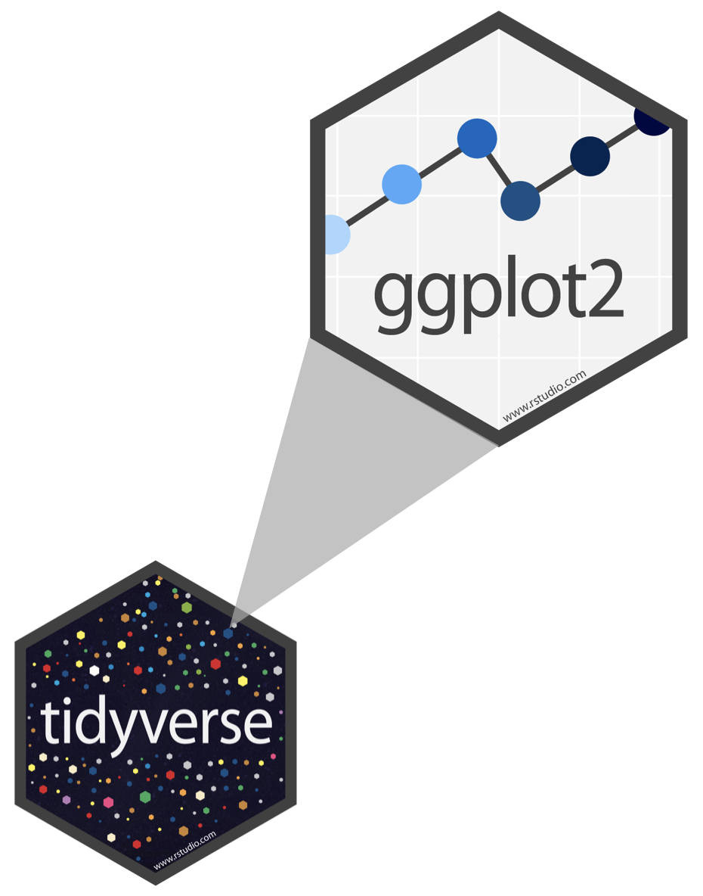
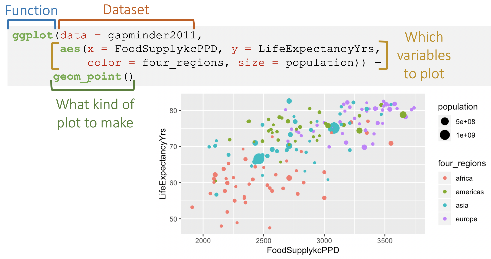

```{r}
#| label: "setup" 
#| include: false
#| message: false
#| warning: false

library(tidyverse)
library(lubridate)
library(janitor)
library(here)
```

## Introduction to `ggplot2`

::::: columns
::: {.column width="46%"}
](../img_slides/horst_ggplot2_exploratory.png){fig-align="center"}
:::

::: {.column width="54%"}
](../img_slides/ggplot2_masterpiece.png){fig-align="center"}
:::
:::::

## `ggplot2` in tidyverse

::::: columns
::: {.column width="40%"}

:::

::: {.column width="60%"}
-   `ggplot2` is tidyverse's data visualization package

    -   This is one of the main ways to create plots and explore data

 

-   The `gg` in "ggplot2" stands for Grammar of Graphics

 

-   It is inspired by the book **Grammar of Graphics** by Leland Wilkinson

    -   Make graphs/plots by combining independent components
    -   Start with a basic plot then add layers
:::
:::::

```{css, echo=FALSE}
.reveal code {
  max-height: 100% !important;
}
```

## Works best with "tidy" data[^1]

[^1]: Source: R for Data Science. Grolemund and Wickham.

{fig-align="center"}

1.  Each variable must have its own column.

2.  Each observation must have its own row.

3.  Each value must have its own cell.

## Basics of a ggplot

{fig-align="center"}

## Grammar of ggplot2

::::: columns
::: {.column width="60%"}
{fig-align="center" width="1600"}
:::

::: {.column width="40%"}
-   `ggplot2` needs at least the following three to produce a chart:
    -   data, a mapping, and a layer

 

-   For the most part, there are default settings for the other parts:
    -   scales, facets, coordinates, and themes
:::
:::::

## **Data**

-   ggplot2 uses data to construct a plot

-   Works best with tidy data (when every observation is a row and each variable is a column)

-   First step in plotting:

    -   Pass the data to the `ggplot` function, which stores the data to be used later by other parts of the plotting system

## Data

-   For example, if we intend to make a graphic about the `mpg` dataset, we would start as follows:

```{r}
#| fig-width: 6
#| fig-height: 4
#| fig-align: center
#| output-location: column

ggplot(
  data = mpg
  )
```

## **Mapping**

-   Mappings use the `aes()` function to **map** variables to the different axes on a plot

    -   `aes()` stands for "aesthetics"

## Data + Mapping

-   If we want the `cty` and `hwy` columns to map to the x- and y-coordinates in the plot, we can do that as follows:

```{r}
#| fig-width: 8
#| fig-height: 6
#| fig-align: center
#| output-location: column


ggplot(
  mpg, 
  mapping = aes(
    x = cty, 
    y = hwy
    )
  )
```

## **Layers**

-   Every layer consists of three important parts:

    -   The **geometry** that determines *how* data are displayed, such as points, lines, or rectangles

    -   The **statistical transformation** that may compute new variables from the data and affect *what* of the data is displayed.

    -   The **position adjustment** that primarily determines *where* a piece of data is being displayed

-   A layer can be constructed using the `geom_*()` and `stat_*()` functions

    -   These functions often determine one of the three parts of a layer, while the other two can still be specified.

## Data + Mapping + Layers

Here is how we can use two layers to display the `cty` and `hwy` columns of the `mpg` dataset as points and stack a trend line on top:

```{r}
#| fig-width: 6
#| fig-height: 4
#| fig-align: center
#| output-location: column

ggplot(
  mpg, 
  mapping = aes(
    x = cty, 
    y = hwy
    )
  ) +
  geom_point() +  # <1>
  geom_smooth(  # <2> 
    formula = y ~ x, 
    method = "lm"
    )  # <2>
```

1. To create a scatterplot
2. To fit and overlay a line

## We can also make plots with a single variable

-   Data: still `mpg`

-   Mapping: using aesthetic to specify only one variable in the x-axis (`cty`)

-   Layers: using `geom_histogram()` to show a plot of the counts per `cty` (which is city mileage)

```{r}
#| fig-width: 6
#| fig-height: 4
#| fig-align: center
#| output-location: column

ggplot(mpg, aes(cty)) +
  # to create a histogram
  geom_histogram()
```

## Let's take a second to try this out

-   Make sure you are working in a Quarto document that has all the libraries loaded

-   Use `glimpse()` to look at the variables in `mpg`

-   Choose one of the variables to make a plot for

<!-- -->

-   Go to this site: <https://bookdown.dongzhuoer.com/hadley/ggplot2-book/geom>

    -   Choose one of the "One variable" geoms that would work well for the variable you chose (discrete or continuous options)

-   Make a plot for the variable!

```{r}
#| echo: false
countdown::countdown(5)
```

## We can add more to plots!

We can change labels!

```{r}
#| fig-width: 6
#| fig-height: 4
#| fig-align: center
#| code-line-numbers: "3-4"

ggplot(mpg, aes(cty)) +
  geom_histogram() +
  labs(x = "City mileage (mpg)", y = "Frequency", 
       title = "Histogram of city mileage")
```

## Adding more to plots!

Increase (or decrease) text size so we can read it / it fits nicely!

```{r}
#| fig-width: 6
#| fig-height: 4
#| fig-align: center
#| code-line-numbers: "5-7"
ggplot(mpg, aes(cty)) +
  geom_histogram() +
  labs(x = "City mileage (mpg)", y = "Frequency", 
       title = "Histogram of city mileage") +
  theme(axis.text = element_text(size = 15), 
        axis.title = element_text(size = 15), 
        title = element_text(size = 15))
```

## Take a moment

-   To add labels to your plot and change the text size if you want
-   If you have time, look up help on the `element_text()` function
    -   See if you can tilt your text or change the color
    
```{r}
#| echo: false
countdown::countdown(5)
```

## Resources on `ggplot`

-   `ggplot2` package website: <https://ggplot2.tidyverse.org/articles/ggplot2.html>
-   Online textbook for `ggplot2`: <https://ggplot2-book.org/>
-   Another online resource for data visualization with `ggplot2`: <https://socviz.co/index.html#preface>
