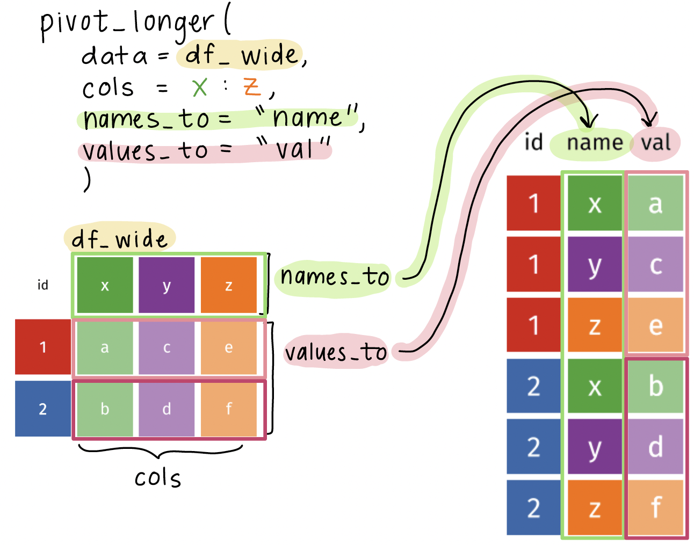

```{r}
#| label: "setup" 
#| include: false
#| message: false
#| warning: false

pacman::p_load(
  here, 
  tidyverse, 
  writexl, 
  rstatix, 
  janitor, 
  naniar,
  gt,
  gtsummary,
  readxl, 
  rio, 
  skimr
)
```

```{r}
#| label: "import data" 
#| echo: false
hrs_data_rds <- import(here("data", "hrs_data.rds"))
hrs_wide_cond <- import(here("data", "hrs_wide_conditions.rds"))
hrs_wide_3yrs <- import(here("data", "hrs_wide_3years.rds")) |>
  select(-age_2018)
hrs_00 <- clean_names(hrs_data_rds) |>
  relocate(diab, degree, .after = id)
```

## Tidy data[^1]

[^1]: Source: R for Data Science. Grolemund and Wickham.


1.  Each variable must have its own column

2.  Each observation must have its own row

3.  Each value must have its own cell

## Let's look at an example[^2] of data represented in different ways

[^2]: Source: R for Data Science. Grolemund and Wickham. [Example pulled from Section 5.2](https://r4ds.hadley.nz/data-tidy.html#sec-tidy-data)

We will look at a dataset measuring tuberculosis (TB) cases for different countries. We have information on the country, year, population, and number of TB cases: 

::: columns
::: {.column width="30%"}
[**Each column is one piece of information:**]{style="color:#EF85B3;"}

::: {style="font-size: 70%;"}
```{r}
#| echo: false
table1
```
:::
:::
::: {.column width="38%"}
[**Population and cases are "types" of counts:**]{style="color:#5BAFF8;"}

::: {style="font-size: 70%;"}
```{r}
#| echo: false
table2
```
:::
:::
::: {.column width="30%"}
[**We look at the rate of TB cases:**]{style="color:#F39C12;"}

::: {style="font-size: 70%;"}
```{r}
#| echo: false
table3
```
:::
:::
:::

## What do we do when our data are not tidy?

- In HRS data, let's say we have data on 3 years' worth of self-reported health (`srh`)

```{r}
tibble(hrs_wide_3yrs)
```

::: pink
::: pink-cont
Current issue: information on the year is stored within column names
:::
:::

## The `pivot_longer()` function

`pivot_longer()`: function used to **lengthen data**, which means it takes multiple columns and collapses them into new columns (based on names and values)

 

```{r}
#| eval: false

df_long <- pivot_longer(
  data = df_wide,
  cols = columns_to_pivot,
  names_to = "name",
  values_to = "val"
)
```

- `data` will usually be fed using the pipe operator (`|>`)
- `cols` specifies the columns to pivot into longer format
  - You can specify a range of columns using `:` or use `starts_with()`, `ends_with()`, or `contains()` to select columns
- `names_to` specifies the name of the new column that will contain the original column names
- `values_to` specifies the name of the new column that will contain the values from the original columns

## Visual of what `pivot_longer()` does

{fig-align="center"}

## Using the pivot_longer() function on the HRS dataset

- We want to 
  - Keep the `id` column as is
  - Pivot the 2018 to 2022 columns into longer format
  - Create a new column called `year` that contains the original column names
  - Create a new column called `srh` that contains the values from the original columns
  
```{r}
hrs_01_long <- hrs_wide_3yrs |> #<1>
  pivot_longer( #<2>
    cols = `2018`:`2022`, #<3>
    names_to = "year",   #<4>
    values_to = "srh" #<5>
  ) #<2>
```

1. Feed `hrs_wide_3yrs` into the `pivot_longer()` function
2. Use `pivot_longer()` to specify the columns to pivot into longer format
3. Specify the columns to pivot using `cols =` and the range of columns to pivot
4. Use `names_to =` to move column names (2018, 2020, and 2022) to become values in a new column called `year`
5. Use `values_to =` to move the values from the original columns (`srh` values under 2018, 2020, and 2022) to become values in a new column called `srh`


## Let's compare the before and after!

::: columns
::: column
Original, wide dataset:

```{r}
tibble(hrs_wide_3yrs)
```
:::
::: column
New, tidy, longer dataset:

```{r}
tibble(hrs_01_long)
```
:::
:::

::: pink
::: pink-cont
**Notes:** number of rows is **3 times longer**, **each individual has 3 rows** of observations, **each year has its own row**
:::
:::

## Wrap-up

- We don't always get data in the format we want

 

- The `pivot_longer()` function is a great tool to help us transform our data into a tidy format

 

- This will help us a lot in grouping summaries and visualizations
  - For example: if we want a summary by year, we can now group by the `year` column

## Resources

- More information of the `pivot_longer()` function can be found [here](https://tidyr.tidyverse.org/reference/pivot_longer.html)
