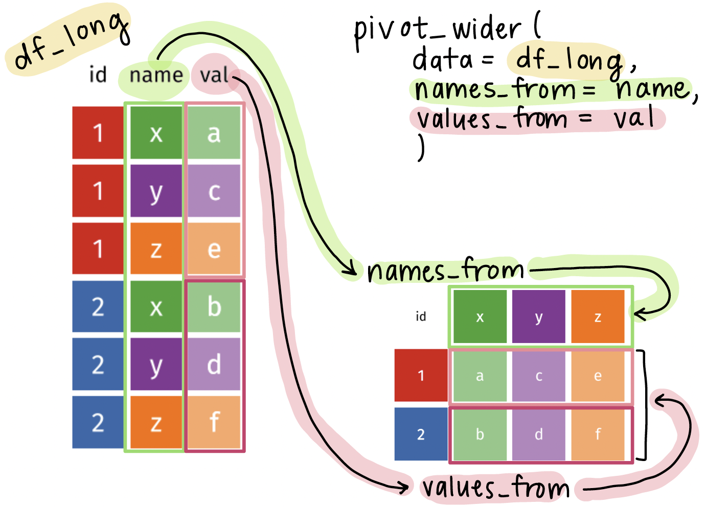

```{r}
#| label: "setup" 
#| include: false
#| message: false
#| warning: false

pacman::p_load(
  here, 
  tidyverse, 
  writexl, 
  rstatix, 
  janitor, 
  naniar,
  gt,
  gtsummary,
  readxl, 
  rio, 
  skimr
)
```

```{r}
#| label: "import data" 
#| echo: false
hrs_data_rds <- import(here("data", "hrs_data.rds"))
hrs_long_cond <- import(here("data", "hrs_long.rds"))
hrs_00 <- clean_names(hrs_data_rds) |>
  relocate(diab, degree, .after = id)
```

## Tidy data[^1]

[^1]: Source: R for Data Science. Grolemund and Wickham.


1.  Each variable must have its own column

2.  Each observation must have its own row

3.  Each value must have its own cell

## Let's look at an example[^2] of data represented in different ways

[^2]: Source: R for Data Science. Grolemund and Wickham. [Example pulled from Section 5.2](https://r4ds.hadley.nz/data-tidy.html#sec-tidy-data)

We will look at a dataset measuring tuberculosis (TB) cases for different countries. We have information on the country, year, population, and number of TB cases: 

::: columns
::: {.column width="30%"}
[**Each column is one piece of information:**]{style="color:#EF85B3;"}

::: {style="font-size: 70%;"}
```{r}
#| echo: false
table1
```
:::
:::
::: {.column width="38%"}
[**Population and cases are "types" of counts:**]{style="color:#5BAFF8;"}

::: {style="font-size: 70%;"}
```{r}
#| echo: false
table2
```
:::
:::
::: {.column width="30%"}
[**We look at the rate of TB cases:**]{style="color:#F39C12;"}

::: {style="font-size: 70%;"}
```{r}
#| echo: false
table3
```
:::
:::
:::

## What do we do when our data are not tidy?

- In HRS data, let's say we have data on many conditions

```{r}
tibble(hrs_long_cond)
```

::: pink
::: pink-cont
Current issue: Column `has_condition` has information on many conditions. `Yes` can mean a person has diabetes or lung disease.
:::
:::

## The `pivot_wider()` function

- The `pivot_wider()` function is used to **widen data**, which means it takes a couple columns and spreads the data across many columns.

```{r}
#| eval: false

df_wide <- pivot_wider(
  data = df_long,
  names_from = column_with_new_headers,
  values_from = column_with_cell_values
)
```

- `data` will usually be fed using the pipe operator (`|>`)
- `names_from` specifies the column that will be used to create new column names
- `values_from` specifies the column that will be used to fill in the new columns with values

## Visual of what `pivot_wider()` does

{fig-align="center"}

## Using the pivot_longer() function on the HRS dataset

- We want to 
  - Keep the `id` column as is
  - Pivot the `condition` column into new columns, one for each condition
  - Put all the values from `has_condition` into the new columns

 

```{r}
hrs_01_wide <- hrs_long_cond |> #<1>
  pivot_wider( #<2>
    names_from = condition, #<3>
    values_from = has_condition #<4>
  ) #<2>
```

1. Feed `hrs_long_cond` into the `pivot_wider()` function
2. Use `pivot_wider()` to specify the columns to pivot into wider format
3. Use `names_from` to specify the old column (`condition`) that the new column names will be pulled from (e.g., `diabetes`, `lung_disease`, `heart_disease`)
4. Use `values_from` to specify the old column (`has_condition`) that the new column values will be pulled from (e.g., `Yes`, `No`)

 

::: green
::: green-cont
**Note:** In `pivot_longer()` we need quotes around the *new* column names, but in **`pivot_wider()` we do *NOT* need quotes around the column names** because they already exist in the dataset.
:::
:::

## Let's compare the before and after!

::: columns
::: column
Original, long dataset:

```{r}
tibble(hrs_long_cond)
```
:::
::: column
New, tidy, wider dataset:

```{r}
tibble(hrs_01_wide)
```
:::
:::

::: pink
::: pink-cont
**Notes:** number of rows is **9 times shorter**, **each individual has 1 row** of observations instead of 9 rows, **each condition has its own column**
:::
:::

## Wrap-up

- We don't always get data in the format we want
  - Sometimes, it's too long!

 

- The `pivot_wider()` function is a great tool to help us transform our data into a tidy format

 

- This will help us a lot in grouping summaries and visualizations

## Resources

- More information of the `pivot_wider()` function can be found [here](https://tidyr.tidyverse.org/reference/pivot_wider.html)
