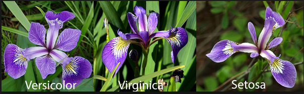
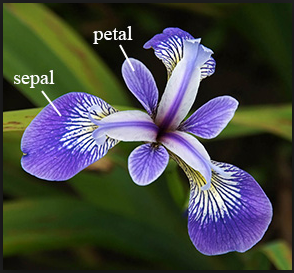
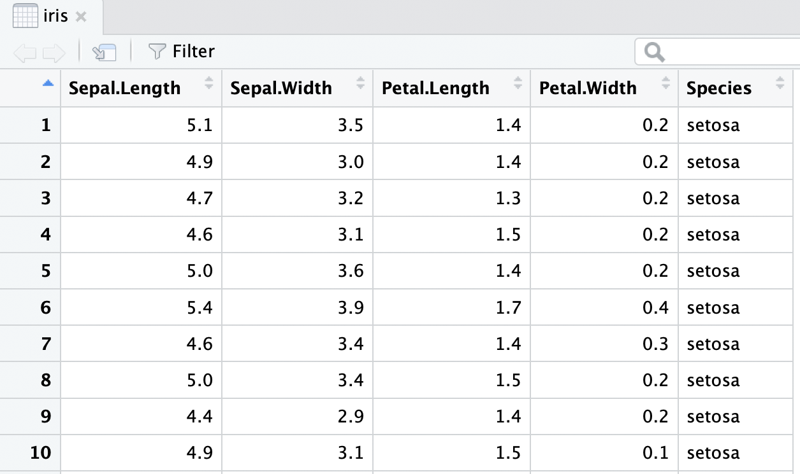
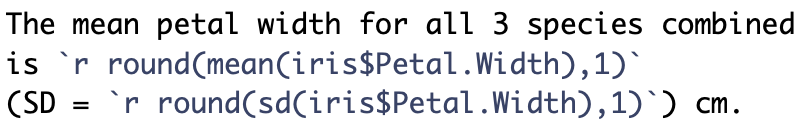

```{r}
#| label: "setup" 
#| include: false
#| message: false
#| warning: false

library(tidyverse)
library(lubridate)
library(janitor)
library(here)

# terminal: for icons
# quarto install extension quarto-ext/fontawesome

# set ggplot theme for slides 
theme_set(
  theme_bw(base_size = 22)
  ) %>%
  theme_update(
    plot.title = element_text(size = 22, hjust = 0.5)
    )
knitr::opts_chunk$set(warning=FALSE, message=FALSE)

source(here("class_dates.R"))
```


## Variables (saved R objects)

Variables are used to store data, figures, model output, etc.

::: columns
::: {.column width="49%"}
-   Can assign a variable using either `=` or `<-`
    -   **Using `<-` is preferable** for certain occasions
    -   I usually just use `=` because less typing hehe

Assign just one value:

```{r}
x = 5
x
x <- 5
x
```
:::

::: {.column width="2%"}
:::

::: {.column width="49%"}
Assign a **vector** of values

-   Consecutive integers using `:`

```{r}
a <- 3:10
a
```

-   **Concatenate** a string of numbers

```{r}
b <- c(5, 12, 2, 100, 8)
b
```
:::
:::

## Let's try it out!

-   Create a new variable `y` that is assigned the value of 8
-   Create a new variable `c` that is assigned the vector of values 15 through 20
-   Create a new variable `d` that is assigned the vector of values 16 through 19 and 22.

 

-   Did you notice anything in the `Environment` section of Rstudio?

```{r}
#| echo: false
countdown::countdown(3)
```

## Doing math with variables

::: columns
::: {.column width="50%"}
Math using variables with just one value

```{r}
x <- 5
x

x + 3

y <- x^2
y
```
:::

::: {.column width="50%"}
Math on vectors of values:\
**element-wise** computation

```{r}
a <- 3:6
a

a+2; a*3

a*a
```
:::
:::

## Let's try it out!

-   Use the variable name `y` to find the addition of `y` and 5
-   Add 5 to the vector `c`

```{r}
#| echo: false
countdown::countdown(2)
```

## Variables can include text (characters)

```{r}
hi <- "hello"
hi

greetings <- c("Guten Tag", "Hola", hi)
greetings
```


## Fisher's (or Anderson's) Iris data set

Data description:

-   n = 150
-   3 species of Iris flowers (Setosa, Virginica, and Versicolour)
    -   50 measurements of each type of Iris
-   **Variables**:
    -   sepal length, sepal width, petal length, petal width, and species

<center></center>

[Gareth Duffy](https://github.com/Datagatherer2357/Gareth-Duffy-GMIT-Project)

## View the `iris` dataset

-   The `iris` dataset is already pre-loaded in *base* R and ready to use.
-   Type the following command in the console window
    -   *Warning: this command cannot be rendered. It will give an error.*

 

::: columns
::: {.column width="37%"}
```{r}
#| eval: false

View(iris)
```

A new tab in the scripting window should appear with the `iris` dataset.
:::

::: {.column width="63%"}
{fig-align="center"}
:::
:::

## Data structure (1/2)

-   What are the different **variable types** in this data set?

- We are going to use the `str` function

  - Can you use the console to tell me what we can input into `str`?


## Data structure (2/2)

-   What are the different **variable types** in this data set?

- We are going to use the `str` function

  - Can you use the console to tell me what we can input into `str`?

\

```{r}
str(iris)   # structure of data
```

## Data set summary

-   Can we quickly summarize all the data?

```{r}
summary(iris)
```

## Data set info

-   You can use different functions to find information on a data frame

```{r}
dim(iris)
nrow(iris)
ncol(iris)
names(iris)
```

-   We can also look at the `Environment` section

## Take a moment to find the information on the iris data frame

- Go to environment section to see the `iris` data frame

## View the beginning or end of a dataset

- These commands can be helpful if the data frame has a lot of rows
```{r}
head(iris)
tail(iris)
```

## Specify how many rows to view at beginning or end of a dataset

```{r}
head(iris, 3)
tail(iris, 2)
```

## The `$`

- Suppose we want to single out the column of petal width values.
- One way to do this is to use the `$`
    * `DatSetName$VariableName`

```{r}
iris$Petal.Width
```


## Example using the `$`

The `$` is helpful if you want to create a new dataset for just that one variable, or, more commonly, if you want to calculate summary statistics for that one variable.

\

```{r}
mean(iris$Petal.Width)
sd(iris$Petal.Width)
median(iris$Petal.Width)
```


## Inline code

* With markdown you can also report __R code output inline__ with the text instead of using a chunk.

::: columns
::: {.column width="50%"}
**Text in editor:**

{fig-align="center"}
:::

::: {.column width="50%"}

**Output:** 

The mean petal width for all 3 species combined is `r round(mean(iris$Petal.Width),1)` 
(SD = `r round(sd(iris$Petal.Width),1)`) cm.

:::
:::

- Reporting summary statistics this way in a report, makes the numbers computationally reproducible.
- For example, if this were for an abstract and a year later you are wondering where the numbers came from, your R code will tell you exactly which dataset was used to calculate the values.


## Some sources for useful base R commands

-   <https://sites.calvin.edu/scofield/courses/m143/materials/RcmdsFromClass.pdf>
-   <https://www2.kenyon.edu/Depts/Math/hartlaub/Math206%20Spring2011/R.htm>


