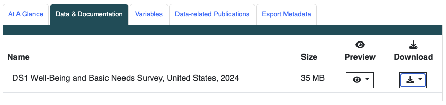
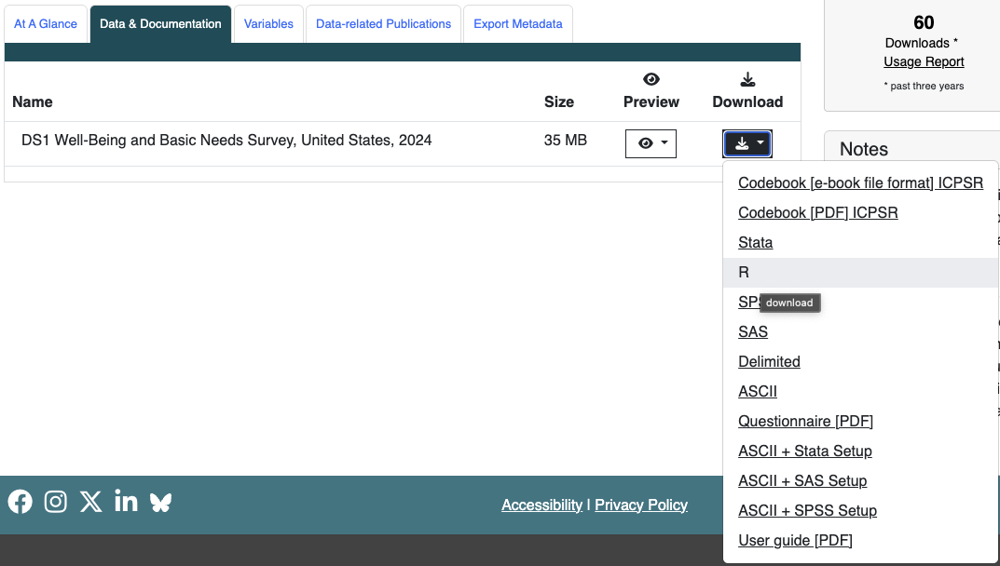

::: callout-important
This lab is **ready**! (Nicky 6/30/26)
:::

```{r}
#| message: false
#| echo: false

# PLEASE DO NOT REMOVE THIS CODE CHUNK!!!
### ADD YOUR LIBRARIES HERE!!! ####
pacman::p_load( # These are my goto packages to load
  here, 
  tidyverse, 
  writexl, 
  rstatix, 
  janitor, 
  naniar,
  gt,
  gtsummary,
  readxl
)
```

```{=html}
<style>
/* Hide numbers for H1 and H2 in the main body */
h1 .header-section-number, 
h2 .header-section-number {
    display: none;
}
</style>
```

## Directions {.unnumbered}

Please turn in your `.qmd` and `.html` file on Brightspace. Please use the same naming convention as practice assignments: `lastname_firstinit_lab_01.qmd` and `lastname_firstinit_lab_01.html`.

[You can download the `.qmd` file for this lab here.](https://github.com/nwakim/PUBH_523_26Su/blob/main/project/lastname_firstinit_lab_01.qmd)

The above link will take you to your **editing** file. **Please do not remove anything from this editing file!!** You will only add your code and work to this file.

## Purpose {.unnumbered}

**The purpose of this lab is to familiarize yourself with the Well-Being and Basic Needs Survey (WBNS) dataset**, understand its structure and components, and prepare it for further data transformations. This includes downloading the data, organizing your project files, loading the data into R, and making initial modifications to ensure it's in a working format for your project.

## Lab activities

### Familiarize yourself with the Well-Being and Basic Needs Survey

Please read the [Urban Institute's page](https://www.urban.org/policy-centers/health-policy-center/projects/well-being-and-basic-needs-survey) on the Well-Being and Basic Needs Survey (WBNS) and more of their [published information of the survey](https://www.urban.org/sites/default/files/publication/98919/the_well-being_and_basic_needs_survey_1.pdf) (at least the first 4 pages). You can also read about the overarching [From Safety Net to Solid Ground Initiative](https://www.urban.org/tags/safety-net-solid-ground#about) that started the survey. Answer the following questions:

- What is the motivation for this study?
- How could an information sheet on components of the WBNS help change policy?
- Why is it important to study basic needs?

::: callout-important
#### Task

Answer the following questions using information on WBNS:

- What is the motivation for this study?
- How could an information sheet on components of the WBNS help change policy?
- Why is it important to study basic needs?
:::

### File organization

Before downloading the data, set up your folders for the class and project. You may use the `.Rproj` already made in our class folder or make a new, project-specific `.Rproj` file. Make sure you are working with the project by using the `here()` function to display your working directory.

::: callout-important
#### Task

Display your working directory using the `here` package and `here()` function.

Insert an image of your folder organization with the `.Rproj` file in the correct place.
:::

### Access and download the data

1.  Go to the [Health and Medical Care Archive page for the 2024 Well-Being and Basic Needs Survey](https://www.icpsr.umich.edu/web/HMCA/studies/39691/datadocumentation)
2.  Go to the Data & Documentation tab 
3.  Download the R version of the Public use data 
4.  Read and agree to the Terms of Use. After this, you will be redirected to a new page.
5.  Log into ICPSR by clicking "Access through your institution". You should be taken to a new page where you need to select "Oregon Health & Science University"  {width="300px"}
6.  Login using standard OHSU login. Then the download should begin!
7.  Make sure to move this into your project folder under the "data" folder.
8.  Take a look at the folders/files you just downloaded. Make sure to locate and understand the difference between the Codebook, Questionnaire, and User Guide. (Note that the website also contains the codebook if you go to the variable tab. I think the online one has an easier user interface than the pdf.)
9.  **Read the User Guide!** There is some important information about the dataset and how to use it.

::: callout-important
#### Task

No task to report back on. Just make sure you have the data and read the User Guide!
:::

### Load the data and rename the dataset

The dataset you downloaded from ICPSR comes compressed in a zip file. Once you unzip it, locate the R data file (called `39691-0001-Data.rda`) inside the DS0001 folder.

Using your `.Rproj` location and the `here()` function, load your data using the appropriate functions for the file type and file path. Once your data are loaded, assign the dataset a cleaner, more intuitive name for your project workflows. I used `wbns_data` for my dataset name, but you can choose any name you like!

::: callout-important
#### Task

Load your downloaded data file into R. Rename the loaded object to a clean dataset name of your choice. (Make sure to show the code for this!)
:::

### Decide on your project question

At the end of this project, we will create a scrolling fact/information sheet that will display summaries and visuals of the WBNS data that focus on a specific question.

Choose one of the following 3 options for your project scope (you may change this at any point in the quarter):

+----+------------------------------------------------------------------------------------------------------------------------+------------------------------------------------------------------------------------------------------------------------------------------------------------------------------------------------+
| \# | Project Question                                                                                                       | Population                                                                                                                                                                                     |
+====+========================================================================================================================+================================================================================================================================================================================================+
| 1  | For individuals under the federal poverty line, how do food support systems help individuals' food security?           | People under 100% federal poverty line (FPL) and received free groceries or meals in the past 12 months                                                                                        |
+----+------------------------------------------------------------------------------------------------------------------------+------------------------------------------------------------------------------------------------------------------------------------------------------------------------------------------------+
| 2  | For individuals who identify as LGBTQ, how does trust and/or fair treatment in healthcare effect self-reported health? | People who identify as LGBTQ and have a healthcare provider.                                                                                                                                   |
|    |                                                                                                                        |                                                                                                                                                                                                |
|    |                                                                                                                        | (You can change this population if you want. For example, you may want to focus on how trust and fair treatment may improve health for people with larger bodies. Check out Q70F for options!) |
+----+------------------------------------------------------------------------------------------------------------------------+------------------------------------------------------------------------------------------------------------------------------------------------------------------------------------------------+
| 3  | For individuals with school-aged children, how do benefits received effect their mental health?                        | People who have at least one child (aged 5-18 years old) in the household and are under the 100% FPL                                                                                           |
+----+------------------------------------------------------------------------------------------------------------------------+------------------------------------------------------------------------------------------------------------------------------------------------------------------------------------------------+

 

**NOTE:** If you are inspired by another question that can be answered with WBNS, feel free to pursue it! Just make sure to check with me first to ensure that it is feasible with the data!

::: callout-important
#### Task

Write down your chosen project option number and question.
:::

### Getting data in working format

Use the following code (with your dataset's name) to remove the parentheses with values that are in front of the category names. You need to copy this code and change `old_df` and `new_df` to your respective dataset names.

```{r}
#| eval: false

new_df <- old_df |>
  mutate(
    across(
      where(is.factor), ~ {
        levels(.) <- gsub("^\\(-?\\d+\\)\\s*", "", levels(.))
        .
        }
      )
    )
```

Use `glimpse` to verify that the parentheses are gone.

::: callout-important
#### Task

Remove the parentheses with values that are in front of the category names. Verify that the parentheses are gone using `glimpse()`.
:::

### Save data for processing with `.Rda`

Within this document, or in a separate document, use R to save a copy of the dataset so that you can process it without changing the raw data. Recall the file organization that we discussed to set up proper folders. Include a screenshot showing the new `.Rda` file within your data folder.

::: callout-important
#### Task

Include a screenshot showing the new `.Rda` file within your data folder.
:::
